# Fig.5 & Fig.S5

In this pipeline, we showed the detail codes in Fig.5 & Fig.S5.

```r

library(future.apply)
library(dplyr)
library(limma)
library(Rsubread)
library(trqwe)
library(ggplot2)
library(ChIPQC)
source("./programme/R_PACKAGES/my_code/MyBestFunction_scRNA.R")
library(ChIPseeker)
library(TxDb.Hsapiens.UCSC.hg38.knownGene)
library(clusterProfiler)
library(org.Hs.eg.db)
library(org.Mm.eg.db)
library(dplyr)
library(limma)
library(Rsubread)
library(GenomicRanges)
library(DESeq2)
library(ggrepel)
library(data.table)
library(dplyr)
library(limma)
library(Rsubread)
library(GenomicRanges)


```


## Fig5A

```r

files <- list.files(path = "./workshop/CUT-TAG/IPM/IPM_A549/MACS3/narrow", pattern = ".macs3.narrow_peaks.narrowPeak$", full.names = TRUE)
files <- files[c(17:20)]
name <- gsub(".macs3.narrow_peaks.narrowPeak","",basename(files))

all_myPeaks <- future_lapply(files, ChIPQC:::GetGRanges, simple = TRUE)
names(all_myPeaks) <- name
consensusToCount <- XY_runConsensusRegions(GRangesList(all_myPeaks), "none")

bamsToCount <- dir("./workshop/CUT-TAG/IPM/IPM_A549/bam/", full.names = TRUE, pattern = "*.\\.bam$")
bamsToCount <- bamsToCount[10:13]
regionsToCount <- data.frame(GeneID = paste("ID", seqnames(consensusToCount), 
    start(consensusToCount), end(consensusToCount), sep = "_"), Chr = seqnames(consensusToCount), 
    Start = start(consensusToCount), End = end(consensusToCount), Strand = strand(consensusToCount))
fcResults <- featureCounts(bamsToCount, annot.ext = regionsToCount, isPairedEnd = TRUE, 
    countMultiMappingReads = FALSE, maxFragLength = 100,nthreads=20)
myCounts <- fcResults$counts   
write.csv(myCounts,file="./workshop/CUT-TAG/IPM/IPM_A549/DEG/p391.FLAG.raw.counts.csv")

myCounts <- read.csv(row.names=1,file="./workshop/CUT-TAG/IPM/IPM_A549/MACS3_new/hs_q0.05_narrow/DEG/p391.FLAG.raw.counts.csv")
Group <- c("IgG","NF391", "NF391", "NF391")
metaData <- data.frame(Group, row.names = colnames(myCounts))
metaData$sample <- gsub(".filter.dupli.bam","",colnames(myCounts))
atacDDS <- DESeqDataSetFromMatrix(myCounts, metaData, ~Group, rowRanges = consensusToCount)
atacDDS <- DESeq(atacDDS,parallel=T)
NF391_vs_IgG_res <- results(atacDDS, c("Group", "NF391", "IgG"), format = "GRanges", parallel=T)
NF391_vs_IgG_res <- as.data.frame(NF391_vs_IgG_res)
rownames(NF391_vs_IgG_res) <- rownames(myCounts)
write.csv(NF391_vs_IgG_res,file="./workshop/CUT-TAG/IPM/IPM_A549/MACS3_new/hs_q0.05_narrow/DEG/p391.FLAG.res.csv")

NF391_vs_IgG$group <- ifelse(NF391_vs_IgG$pvalue < 0.05 & abs(NF391_vs_IgG$log2FoldChange) > 1, 
  ifelse(NF391_vs_IgG$pvalue < 0.05 & NF391_vs_IgG$log2FoldChange > 1, "UP", "DOWN"), "NS")
table(NF391_vs_IgG$group)
NF391_vs_IgG_up <- NF391_vs_IgG[which(NF391_vs_IgG$group == "UP"),]
write.table(NF391_vs_IgG_up, file = "./workshop/CUT-TAG/IPM/IPM_A549/MACS3_new/hs_q0.05_narrow/DEG/NF391_vs_IgG_up.bed",
    sep="\t",col.names=FALSE,row.names=FALSE,quote=FALSE)

computeMatrix reference-point --referencePoint center -b 3000 -a 3000 \
-R ./workshop/CUT-TAG/IPM/IPM_A549/MACS3_new/hs_q0.05_narrow/DEG/NF391_vs_IgG_up.bed \
-S IgG.bw combine_all_p391.bw \
--numberOfProcessors 30 --skipZeros \
--missingDataAsZero \
-o ./workshop/CUT-TAG/IPM/IPM_A549/MACS3_new/hs_q0.05_narrow/DEG/center.NF391_vs_IgG_up.mat.gz 

plotHeatmap -m ./workshop/CUT-TAG/IPM/IPM_A549/MACS3_new/hs_q0.05_narrow/DEG/center.NF391_vs_IgG_up.mat.gz \
 -out ./workshop/CUT-TAG/IPM/IPM_A549/MACS3_new/hs_q0.05_narrow/DEG/center.NF391_vs_IgG_up.pdf  \
 --colorList  'white,#4682B4' 'white,#4682B4' 'white,#4682B4' \
 --missingDataColor "white"


```
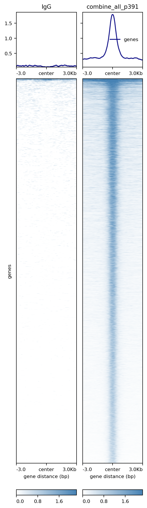

## FigS5A

```r

library(ChIPpeakAnno)

hs_TEs <- mcreadRDS("./workshop/RNAseq_ref/TEtranscripts/hg38_rmsk_TE.rds",mc.cores=20)
hs_TEs$id <- paste0(hs_TEs[,1],"_",hs_TEs[,2],"_",hs_TEs[,3])
hs_TEs <- hs_TEs[!duplicated(hs_TEs$id),]
hs_TEs <- toGRanges(hs_TEs)

NF391_vs_IgG_up <- read.table(file = "./workshop/CUT-TAG/IPM/IPM_A549/MACS3_new/hs_q0.05_narrow/DEG/NF391_vs_IgG_up.bed",
    sep="\t",header=FALSE)
NF391_vs_IgG_up <- NF391_vs_IgG_up[,1:3]
colnames(NF391_vs_IgG_up) <- c("chr","start","end")
NF391_vs_IgG_up <- toGRanges(NF391_vs_IgG_up)

NF391_vs_IgG_up.TE <- annoPeaks(NF391_vs_IgG_up, 
                       annoData = hs_TEs,
                       bindingType='fullRange', 
                       bindingRegion=c(-1,1),
                       ignore.peak.strand=TRUE, 
                       select='bestOne')
write.csv(as.data.frame(NF391_vs_IgG_up.TE),"./workshop/CUT-TAG/IPM/IPM_A549/MACS3_new/hs_q0.05_narrow/DEG/NF391.vs.IgG.up.TE.anno.csv")

NF391_vs_IgG_up.TE <- read.csv(row.names=1,"./workshop/CUT-TAG/IPM/IPM_A549/MACS3_new/hs_q0.05_narrow/DEG/NF391.vs.IgG.up.TE.anno.csv")
NF391_vs_IgG_up.TE$class_id <- as.character(NF391_vs_IgG_up.TE$class_id)
NF391_vs_IgG_up.TE$TE.gene.class <- "other_TE"
NF391_vs_IgG_up.TE[which(NF391_vs_IgG_up.TE$class_id %in% c("DNA","LINE","LTR","SINE","Satellite")),]$TE.gene.class <- NF391_vs_IgG_up.TE[which(NF391_vs_IgG_up.TE$class_id %in% c("DNA","LINE","LTR","SINE","Satellite")),]$class_id
table(NF391_vs_IgG_up.TE$TE.gene.class)
TE.res <- NF391_vs_IgG_up.TE$TE.gene.class
TE.res <- as.character(TE.res)

NF391_vs_IgG_up <- read.table(file = "./workshop/CUT-TAG/IPM/IPM_A549/MACS3_new/hs_q0.05_narrow/DEG/NF391_vs_IgG_up.bed",
    sep="\t",header=FALSE)
NF391_vs_IgG_up$id <- paste0(NF391_vs_IgG_up$V1,"_",NF391_vs_IgG_up$V2,"_",NF391_vs_IgG_up$V3)
NF391_vs_IgG_up.TE$id <- paste0(NF391_vs_IgG_up.TE$seqnames,"_",NF391_vs_IgG_up.TE$start,"_",NF391_vs_IgG_up.TE$end)
NF391_vs_IgG_up.TE$id <- as.character(NF391_vs_IgG_up.TE$id)
nonTE.id <- setdiff(NF391_vs_IgG_up$id,NF391_vs_IgG_up.TE$id)
nrow(NF391_vs_IgG_up)
nrow(NF391_vs_IgG_up.TE)
length(nonTE.id)

nonTE.peak <- NF391_vs_IgG_up[which(NF391_vs_IgG_up$id %in% nonTE.id),]
nrow(nonTE.peak)
nonTE.peak <- nonTE.peak[,1:3]
colnames(nonTE.peak) <- c("chr","start","end")

nonTE.peak.anno <- annotatePeak(GRanges(nonTE.peak), tssRegion=c(-1, 1),
                         TxDb=txdb, annoDb="org.Hs.eg.db",verbose=FALSE)
nonTE.peak.anno <- as.data.frame(nonTE.peak.anno)
nonTE.peak.anno$annotation_tidy <- nonTE.peak.anno$annotation
nonTE.peak.anno[grep("Intron",nonTE.peak.anno$annotation),]$annotation_tidy <- "Intron"
nonTE.peak.anno[grep("Exon",nonTE.peak.anno$annotation),]$annotation_tidy <- "Exon"
nonTE.peak.anno[grep("Downstream",nonTE.peak.anno$annotation),]$annotation_tidy <- "Downstream"
table(nonTE.peak.anno$annotation_tidy)
nonTE.peak.anno$id <- paste0(nonTE.peak.anno$seqnames,"_",nonTE.peak.anno$start,"_",nonTE.peak.anno$end)

NF391_vs_IgG_up$anno <- "Unknown"
match_indices <- match(NF391_vs_IgG_up$id, NF391_vs_IgG_up.TE$id)
NF391_vs_IgG_up$anno[!is.na(match_indices)] <- NF391_vs_IgG_up.TE$TE.gene.class[match_indices[!is.na(match_indices)]]
match_indices <- match(NF391_vs_IgG_up$id, nonTE.peak.anno$id)
NF391_vs_IgG_up$anno[!is.na(match_indices)] <- nonTE.peak.anno$annotation_tidy[match_indices[!is.na(match_indices)]]
table(NF391_vs_IgG_up$anno)

NF391_vs_IgG_up$anno11 <- "Unknown"
match_indices <- match(NF391_vs_IgG_up$id, NF391_vs_IgG_up.TE$id)
NF391_vs_IgG_up$anno11[!is.na(match_indices)] <- "TEs"
match_indices <- match(NF391_vs_IgG_up$id, nonTE.peak.anno$id)
NF391_vs_IgG_up$anno11[!is.na(match_indices)] <- nonTE.peak.anno$annotation_tidy[match_indices[!is.na(match_indices)]]

png("./workshop/CUT-TAG/IPM/IPM_A549/MACS3_new/hs_q0.05_narrow/DEG/all.class.NF391.peaks.final.final.png")
pie1(table(NF391_vs_IgG_up$anno11))
dev.off()


```

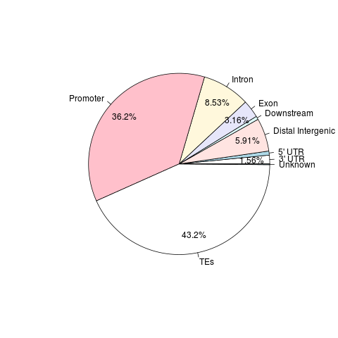


## FigS5B

```r


FLAG_peak_res <- read.csv(row.names=1,"./workshop/ATAC_Seq/IPM/IPM_A549/outs/FLAG.peaks.csv")
ATAC_peak_res <- read.csv(row.names=1,"./workshop/ATAC_Seq/IPM/IPM_A549/outs/ATAC.peaks.csv")

FLAG_peak_gr <- GRanges(FLAG_peak_res)
ATAC_peak_gr <- GRanges(ATAC_peak_res)

list <- list(FLAG_peak_gr,ATAC_peak_gr)
names(list) <- c("FLAG","ATAC")
consensusToCount_FLAG_ATAC <- XY_runConsensusRegions(GRangesList(list), "none")

df <- as.data.frame(elementMetadata(consensusToCount_FLAG_ATAC))
FLAG_ATAC_peaks <- as.data.frame(consensusToCount_FLAG_ATAC)
FLAG_ATAC_peaks <- FLAG_ATAC_peaks[which(FLAG_ATAC_peaks$FLAG == 1),]
FLAG_ATAC_peaks_gr <- GRanges(FLAG_ATAC_peaks)

bamsToCount <- dir("./workshop/ATAC_Seq/IPM/IPM_A549/bam/", full.names = TRUE, pattern = "*.\\.bam$")
bamsToCount <- bamsToCount[c(4:5,7:8)]
regionsToCount <- data.frame(GeneID = paste("ID", seqnames(FLAG_ATAC_peaks_gr), 
    start(FLAG_ATAC_peaks_gr), end(FLAG_ATAC_peaks_gr), sep = "_"), Chr = seqnames(FLAG_ATAC_peaks_gr), 
    Start = start(FLAG_ATAC_peaks_gr), End = end(FLAG_ATAC_peaks_gr), Strand = strand(FLAG_ATAC_peaks_gr))
fcResults <- featureCounts(bamsToCount, annot.ext = regionsToCount, isPairedEnd = TRUE, 
    countMultiMappingReads = FALSE, maxFragLength = 100,nthreads=20)
myCounts <- fcResults$counts  

Group <- c("NF391", "NF391", "pMIC", "pMIC")
metaData <- data.frame(Group, row.names = colnames(myCounts))
metaData$sample <- gsub(".filter.dupli.chrM.last.bam","",colnames(myCounts))
atacDDS <- DESeqDataSetFromMatrix(myCounts, metaData, ~Group, rowRanges = FLAG_ATAC_peaks_gr)
atacDDS <- DESeq(atacDDS,parallel=T)

ATAC_res <- results(atacDDS, c("Group", "NF391", "pMIC"), format = "GRanges", parallel=T)
ATAC_res <- as.data.frame(ATAC_res)
write.csv(ATAC_res,"./workshop/ATAC_Seq/IPM/IPM_A549/outs/ATAC_FLAG.peaks.res.csv")

ATAC_res <- read.csv(row.names=1,"./workshop/ATAC_Seq/IPM/IPM_A549/outs/ATAC_FLAG.peaks.res.csv")
ATAC_res$group <- ifelse(abs(ATAC_res$log2FoldChange) > 0.1  & ATAC_res$baseMean > 100,
    ifelse(ATAC_res$log2FoldChange > 0.1,"UP","DOWN"),"NS")
table(ATAC_res$group)

ATAC_down <- ATAC_res[which(ATAC_res$group == "DOWN"),]

ATAC_down_GR <- GRanges(ATAC_down)

result <- TE_annotate_peaks_and_plot(
  peak_gr = ATAC_down_GR,
  output_file = "./workshop/ATAC_Seq/IPM/IPM_A549/outs/TE.ATAC_FLAG.peaks_down.png"
)

```
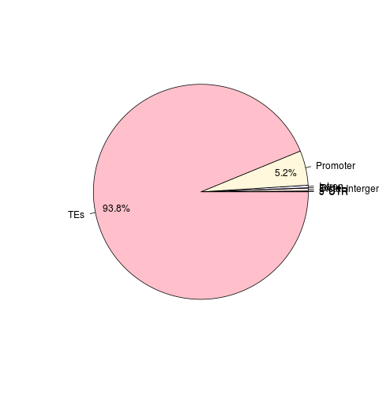


## Fig5B

```r

KMT2C_nc_anno <- read.csv(row.names=1,"./workshop/CUT-TAG/IPM/IPM_A549/KMT2C_NC/KMT2C_nc_peaks.csv")
KMT2C_nc_anno11 <- KMT2C_nc_anno[which(KMT2C_nc_anno$V1 == 1 & KMT2C_nc_anno$V2 == 1),]
KMT2C_nc_gene <- unique(KMT2C_nc_anno11$SYMBOL)
KMT2C_nc_gene <- as.character(KMT2C_nc_gene)

NF391_vs_IgG <- read.csv(row.names=1,file="./workshop/CUT-TAG/IPM/IPM_A549/MACS3_new/hs_q0.05_narrow/DEG/p391.FLAG.res.anno.csv")
NF391_vs_IgG$group <- ifelse(NF391_vs_IgG$pvalue < 0.05 & abs(NF391_vs_IgG$log2FoldChange) > 1, 
  ifelse(NF391_vs_IgG$pvalue < 0.05 & NF391_vs_IgG$log2FoldChange > 1, "UP", "DOWN"), "NS")
NF391_vs_IgG_up <- NF391_vs_IgG[which(NF391_vs_IgG$group == "UP"),]
NF391_gene <- unique(NF391_vs_IgG_up$SYMBOL)
NF391_gene <- as.character(NF391_gene)
NF391_gene <- human2mouse(NF391_gene)

library(Vennerable)
data<-Venn(list(NF391=NF391_gene,KMT2C=KMT2C_nc_gene))
plot(data,doWeight=T,show = list(Faces = FALSE, DarkMatter = FALSE))

png("./workshop/CUT-TAG/IPM/IPM_A549/KMT2C_NC/venn.WT_391.png")
plot(data,doWeight=T,show = list(Faces = FALSE, DarkMatter = FALSE))
dev.off()

enrich_pvalue(24421,3371,3226,2573) 

KMT2C_unique <- setdiff(KMT2C_nc_gene,NF391_gene)
NF391_unique <- setdiff(NF391_gene,KMT2C_nc_gene)
ol_gene <- intersect(KMT2C_nc_gene,NF391_gene)

tmp <- list(KMT2C_unique,NF391_unique,ol_gene)
tmp <- lapply(tmp,function(x) {
	aa <- mapIds(x = org.Mm.eg.db,
            keys = x,
            keytype ="SYMBOL",
            column ="ENTREZID",
            multiVals="first")
	names(aa) <- NULL
	return(aa)
	})
names(tmp) <- c("KMT2C_unique","NF391_unique","cobinding")

dyna_GO_BP <- compareCluster(geneCluster = tmp, fun = "enrichGO",OrgDb = org.Mm.eg.db,readable=T,ont = "BP",pvalueCutoff=0.05)
p <- dotplot(dyna_GO_BP,showCategory=10,includeAll=FALSE) + labs(title = "GO_BP")+ theme(axis.text.x  = element_text(angle=45, vjust=1,size=10,hjust = 1))
write.csv(dyna_GO_BP,file="./workshop/CUT-TAG/IPM/IPM_A549/KMT2C_NC/GO_KMT2C_391_genes.csv")

dyna_GO_BP <- read.csv(row.names=1,file="./workshop/CUT-TAG/IPM/IPM_A549/KMT2C_NC/GO_KMT2C_391_genes.csv")
dyna_GO_BP$log10p <- -log10(dyna_GO_BP$pvalue)
KMT2C_unique <- dyna_GO_BP[which(dyna_GO_BP$Cluster == "KMT2C_unique"),]
NF391_unique <- dyna_GO_BP[which(dyna_GO_BP$Cluster == "NF391_unique"),]
cobinding <- dyna_GO_BP[which(dyna_GO_BP$Cluster == "cobinding"),]

p1 <- ggbarplot(KMT2C_unique[1:5,], x = "Description", y = "log10p",
          fill = "lightblue",           # change fill color by mpg_level
          sort.val = "asc",          # Sort the value in descending order
          ylab = "-log10(padj)",
          legend.title = "Enrichment Group",
          title="KMT2C_unique",
          rotate = TRUE,
          ggtheme = theme_pubr()
          )

p2 <- ggbarplot(NF391_unique[1:5,], x = "Description", y = "log10p",
          fill = "lightblue",           # change fill color by mpg_level
          sort.val = "asc",          # Sort the value in descending order
          ylab = "-log10(padj)",
          legend.title = "Enrichment Group",
          title="NF391_unique",
          rotate = TRUE,
          ggtheme = theme_pubr()
          )

p3 <- ggbarplot(cobinding[1:5,], x = "Description", y = "log10p",
          fill = "lightblue",           # change fill color by mpg_level
          sort.val = "asc",          # Sort the value in descending order
          ylab = "-log10(padj)",
          legend.title = "Enrichment Group",
          title="cobinding",
          rotate = TRUE,
          ggtheme = theme_pubr()
          )

png(height=400,width=600,"./workshop/CUT-TAG/IPM/IPM_A549/KMT2C_NC/GO_WT_unique_genes_p.png")
p1
dev.off()

png(height=400,width=600,"./workshop/CUT-TAG/IPM/IPM_A549/KMT2C_NC/GO_391_unique_genes_p.png")
p2
dev.off()

png(height=400,width=600,"./workshop/CUT-TAG/IPM/IPM_A549/KMT2C_NC/GO_cobinding_genes_p.png")
p3
dev.off()


```

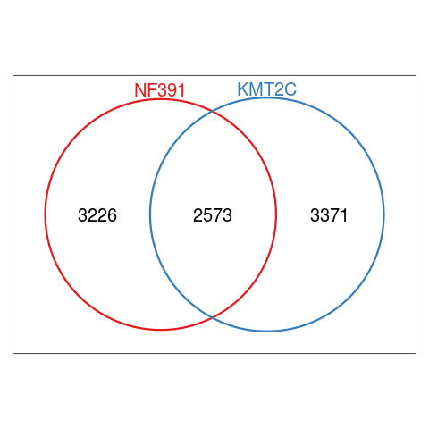

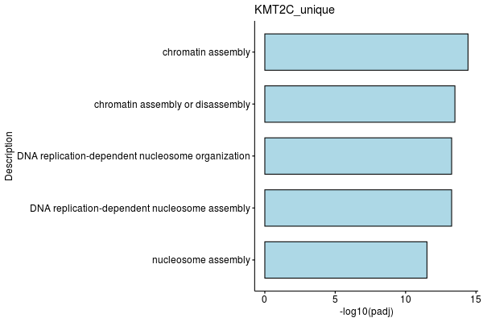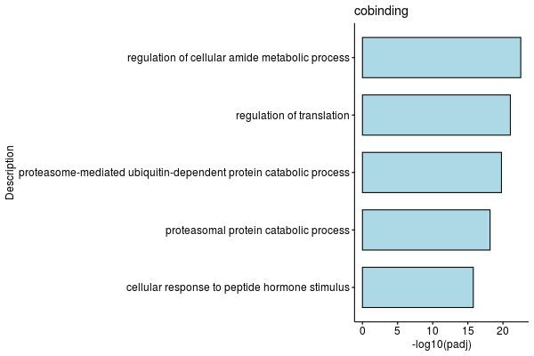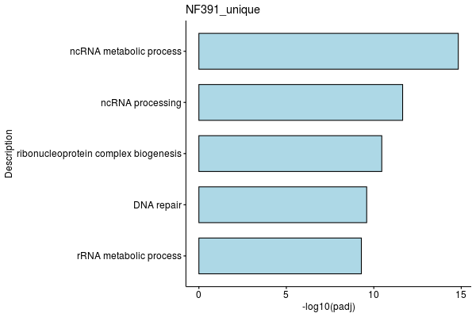

## Fig5C

```r


cd ./workshop/ATAC_Seq/IPM/IPM_A549/bw_files/

computeMatrix reference-point --referencePoint center -b 3000 -a 3000 \
-R ./workshop/CUT-TAG/IPM/IPM_A549/MACS3_new/hs_q0.05_narrow/DEG/NF391_vs_IgG_up.bed  \
-S combine_pMIC_1_2.bw combine_all_NF391_1_2.bw \
--skipZeros --numberOfProcessors 25 \
-o ./workshop/CUT-TAG/IPM/IPM_figure/center.ATAC.NF391.peaks.mat.gz 

plotHeatmap -m ./workshop/CUT-TAG/IPM/IPM_figure/center.ATAC.NF391.peaks.mat.gz  \
 -out ./workshop/CUT-TAG/IPM/IPM_figure/center.ATAC.NF391.peaks.png \
 --colorList 'white, purple' \
 --missingDataColor "white"


All_gsva_seura <- mcreadRDS("./project/WYY_IPM/scRNA_mmu/raw_files/hs.v2.psuodo.100.rds")
all.gene.counts.100 <- FetchData(object = All_gsva_seura, vars = c("cell_type",rownames(All_gsva_seura)),slot="data")
all.gene.counts.100 <- as.data.frame(all.gene.counts.100)

FLAG_gene <- intersect(colnames(all.gene.counts.100),NF391_gene)
all.gene.counts.100$NF391_binding_gene <- rowMeans(all.gene.counts.100[,FLAG_gene])
z_scores <- scale(all.gene.counts.100$NF391_binding_gene)
all.gene.counts.100$NF391_binding_gene_zscore <- z_scores

p1 <- ggboxplot(all.gene.counts.100,
    x="cell_type",y="NF391_binding_gene_zscore",fill="cell_type",add="jitter")+ stat_compare_means(comparisons =list(c("A549_Pmic","A549_391")),
    label = "p = {p}", method = "t.test") 

png(width=350,height=500,"./project/WYY_IPM/scRNA_mmu/for_figure/A549.RNA.FLAG_binding_gene_zscore_100bin.png")
p1
dev.off()


```
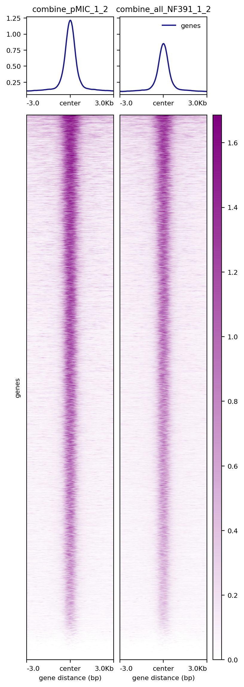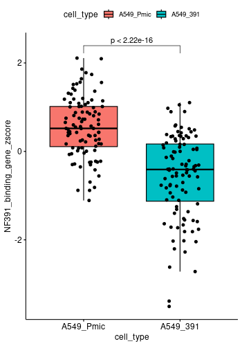


## Fig5D

```r

KMT2C_nc_anno <- read.csv(row.names=1,"./workshop/CUT-TAG/IPM/IPM_A549/KMT2C_NC/KMT2C_nc_peaks.csv")
KMT2C_nc_anno11 <- KMT2C_nc_anno[which(KMT2C_nc_anno$V1 == 1 & KMT2C_nc_anno$V2 == 1),]
KMT2C_nc_gene <- unique(KMT2C_nc_anno11$SYMBOL)
KMT2C_nc_gene <- as.character(KMT2C_nc_gene)

KMT2C_nc_gene_peak <- KMT2C_nc_anno11[,1:3]
write.table(KMT2C_nc_gene_peak, file = "./workshop/CUT-TAG/IPM/IPM_A549/KMT2C_NC/KMT2C.nc.binding.peak.bed",
    sep="\t",col.names=FALSE,row.names=FALSE,quote=FALSE)

cd ./workshop/CUT-TAG/IPM/IPM_A549/KMT2C_NC/

computeMatrix reference-point --referencePoint center -b 3000 -a 3000 \
-R ./workshop/CUT-TAG/IPM/IPM_A549/KMT2C_NC/KMT2C.nc.binding.peak.bed \
-S combine_all_PRM.bw combine_all_PRMK.bw \
--numberOfProcessors 30 --skipZeros \
--missingDataAsZero \
-o center.KMT2C.WT.peaks.to.ATAC.mat.gz 

plotHeatmap -m center.KMT2C.WT.peaks.to.ATAC.mat.gz \
 -out center.KMT2C.WT.peaks.to.ATAC.png  \
 --colorList  'white,red' 'white,red' 'white,red' 'white,red' 'white,red' 'white,red' 'white,red' 'white,red' 'white,red' 'white,red' 'white,red' 'white,red' 'white,red' 'white,red' 'white,red' 'white,red' 'white,red' 'white,red' 'white,red' 'white,red' 'white,red' \
 --missingDataColor "white"


only_sub_sc1 <- mcreadRDS("./workshop/scRNA/SCLC/metastasisi/merge_all/only_sub_sc_0123_30_sub.rds",mc.cores=20)
table(only_sub_sc1$group)

SCLC.only.GSVA <- only_sub_sc1
Idents(SCLC.only.GSVA) <- SCLC.only.GSVA$group
SCLC.only.GSVA$group <- factor(SCLC.only.GSVA$group,levels=c("Scram","Mll3_KO"))
All_gsva_seura_ <- future_lapply(1:length(levels(SCLC.only.GSVA$group)),future.seed = TRUE,function(i) {
    sel_tmp <- subset(SCLC.only.GSVA,idents=levels(SCLC.only.GSVA$group)[i])
    sel_tmp <- pseudo_bulk_seurat_mean_random(seurat_obj=sel_tmp,num_split=100,seed.use=1,slot="data",prefix=levels(SCLC.only.GSVA$group)[i],assay="RNA")
    metadata <- data.frame(cell_type=c(rep(levels(SCLC.only.GSVA$group)[i],100)),
    row.names=colnames(sel_tmp))
    sel_gsva_seurat <- CreateSeuratObject(counts = sel_tmp,assay = 'RNA',project = 'RNA',min.cells = 0,meta.data = metadata)
    message(levels(SCLC.only.GSVA$group)[i], " is done")
    return(sel_gsva_seurat)
}) 
All_gsva_seura <- merge(x = All_gsva_seura_[[1]], y = All_gsva_seura_[c(2:length(All_gsva_seura_))])
All_gsva_seura$cell_type <- factor(All_gsva_seura$cell_type,levels=c("Scram","Mll3_KO"))
Idents(All_gsva_seura) <- All_gsva_seura$cell_type
mcsaveRDS(All_gsva_seura,"./project/WYY_IPM/scRNA_mmu/raw_files/NatureCancer.scRNA.Tumor.RNA.100.rds")

All_gsva_seura <- mcreadRDS("./project/WYY_IPM/scRNA_mmu/raw_files/NatureCancer.scRNA.Tumor.RNA.100.rds",mc.cores=20)
all.gene.counts.100 <- FetchData(object = All_gsva_seura, vars = c("cell_type",rownames(All_gsva_seura)),slot="data")
all.gene.counts.100 <- as.data.frame(all.gene.counts.100)

all.gene.counts.100.key <- all.gene.counts.100[,intersect(KMT2C_nc_gene,colnames(all.gene.counts.100))]
all.gene.counts.100.key$Sig.exp <- rowMeans(all.gene.counts.100.key)
all.gene.counts.100.key <- all.gene.counts.100.key[,c("Sig.exp","Erdr1")]
all.gene.counts.100.key$cell_type <- all.gene.counts.100$cell_type
z_scores <- scale(all.gene.counts.100.key$Sig.exp)
all.gene.counts.100.key$Sig.exp.zscore <- z_scores

all.gene.counts.100.key$cell_type <- factor(all.gene.counts.100.key$cell_type,levels=c("Mll3_KO","Scram"))
p <- ggboxplot(all.gene.counts.100.key,x="cell_type",y="Sig.exp.zscore",fill="cell_type",palette="lancet",
  title="KMT2C WT binding genes",add="none",ylab = "KMT2C WT binding genes")+ RotatedAxis()+
  stat_compare_means(comparisons=list(c("Scram","Mll3_KO")),method="t.test")


png(width=300,height=500,"./project/WYY_IPM/CUTTAG/KMT2C_WT_binding_RNA_100_all.png")
p
dev.off()

```

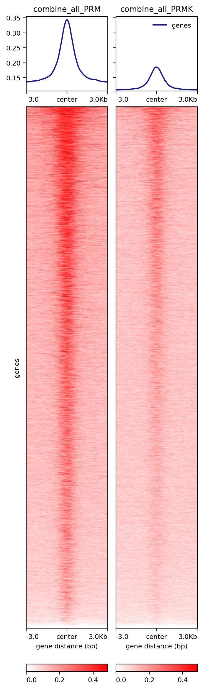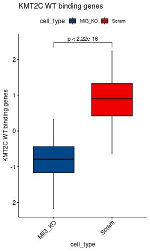

## Fig5E

```r

hs_TEs_df <- mcreadRDS("./workshop/RNAseq_ref/TEtranscripts/hg38_rmsk_TE.rds",mc.cores=20)
hs_TEs_df$ID <- paste0("ID_",hs_TEs_df$seqnames,"_",hs_TEs_df$start,"_",hs_TEs_df$end)

###ATAC
###ATAC

ATAC_norm_counts <- mcreadRDS("./workshop/ATAC_Seq/IPM/IPM_A549/outs/TE_peaks_counts.ATAC.rds",mc.cores=20)
ATAC_norm_counts$ID <- rownames(ATAC_norm_counts)
ATAC_norm_counts_anno <- inner_join(ATAC_norm_counts,hs_TEs_df,by="ID")

ATAC_norm_counts_anno$baseMean <- rowMeans(ATAC_norm_counts_anno[,c(1:4)])
ATAC_norm_counts_anno22 <- ATAC_norm_counts_anno[which(ATAC_norm_counts_anno$baseMean > 10),]

ATAC_TE_counts_gene <- ATAC_norm_counts_anno22 %>%
  group_by(gene_id) %>%
  mutate(pMIC.1=sum(pMIC.1),pMIC.2=sum(pMIC.2),NF391.1=sum(NF391.1),NF391.2=sum(NF391.2)) %>%
  distinct(gene_id, .keep_all = TRUE)
ATAC_TE_counts_gene <- as.data.frame(ATAC_TE_counts_gene)
ATAC_TE_counts_gene$ID <- paste0("ID_",ATAC_TE_counts_gene$class_id,":",ATAC_TE_counts_gene$family_id,":",ATAC_TE_counts_gene$gene_id)
rownames(ATAC_TE_counts_gene) <- ATAC_TE_counts_gene$ID

ATAC_TE_counts_gene$FoldChange <- rowMeans(ATAC_TE_counts_gene[,1:2]) / rowMeans(ATAC_TE_counts_gene[,c(3:4)])
ATAC_TE_counts_gene$log2FoldChange <- log2(ATAC_TE_counts_gene$FoldChange)
ATAC_TE_counts_gene$baseMean <- rowMeans(ATAC_TE_counts_gene[,c(1:4)])
ATAC_TE_counts_gene$ccscore <- ATAC_TE_counts_gene$log2FoldChange^3 * ATAC_TE_counts_gene$baseMean
ATAC_TE_counts_gene$group <- ifelse(abs(ATAC_TE_counts_gene$log2FoldChange) != 0,
    ifelse(ATAC_TE_counts_gene$log2FoldChange > 0,"UP","DOWN"),"NS")
table(ATAC_TE_counts_gene$group)
as.data.frame(table(ATAC_TE_counts_gene$class_id,ATAC_TE_counts_gene$group))

p_values <- apply(ATAC_TE_counts_gene[,c(1:4)], 1, function(x) {
  t.test(x ~ c("p391","p391","pMIC","pMIC"))$p.value
})
p_values <- data.frame(Gene = rownames(ATAC_TE_counts_gene), p_value = p_values)
ATAC_TE_counts_gene$p <- p_values$p_value
ATAC_TE_counts_gene$log10p <- -log10(ATAC_TE_counts_gene$p)
ATAC_TE_counts_gene$log10basemean <- log10(ATAC_TE_counts_gene$baseMean)
ATAC_TE_counts_gene[which(ATAC_TE_counts_gene$log2FoldChange < -1),]$log2FoldChange <- -1

p2 <- ggplot(ATAC_TE_counts_gene[which(ATAC_TE_counts_gene$class_id %in% c("SINE","LINE","DNA","LTR")),], 
	aes(log2FoldChange,log10p,colour=group))+ labs(x="log2FoldChange",y="log10p")
p2 <- p2 + geom_point(alpha=1, size=2)  +scale_colour_manual(name = "", values = alpha(c("#4682B4","#A52A2A"), 1))+
   theme_pubr() + facet_wrap(~class_id,scales="free",nrow=1)+ xlim(-1,1)+
  geom_vline(xintercept=c(0),lty = "dashed",col="black",lwd=1) + ggtitle("TEs in ATAC")

png(width=1200,height=400,"./workshop/ATAC_Seq/IPM/IPM_A549/outs/maplot.TE.split.v2.png")
p2
dev.off()

###H3K9me3
###H3K9me3

H3K9_TE_counts_gene <- read.csv(row.names=1,"./workshop/CUT-TAG/IPM/IPM_A549/DEG/TE.H3K9me3.gene.anno.csv")
H3K9_TE_counts_gene$pMIC.mean <- rowMeans(H3K9_TE_counts_gene[,21:23])
H3K9_TE_counts_gene$NF391.mean <- rowMeans(H3K9_TE_counts_gene[,24:26])
H3K9_TE_counts_gene$FoldChange <- rowMeans(H3K9_TE_counts_gene[,21:23]) / rowMeans(H3K9_TE_counts_gene[,24:26])
H3K9_TE_counts_gene$log2FoldChange <- log2(H3K9_TE_counts_gene$FoldChange)
H3K9_TE_counts_gene$baseMean <- rowMeans(H3K9_TE_counts_gene[,21:26])
H3K9_TE_counts_gene$ccscore <- H3K9_TE_counts_gene$log2FoldChange^3 * H3K9_TE_counts_gene$baseMean
H3K9_TE_counts_gene$group <- ifelse(abs(H3K9_TE_counts_gene$log2FoldChange) != 0,
    ifelse(H3K9_TE_counts_gene$log2FoldChange > 0,"UP","DOWN"),"NS")

p_values <- apply(H3K9_TE_counts_gene[,c(21:26)], 1, function(x) {
  t.test(x ~ c("pMIC","pMIC","pMIC","p391","p391","p391"))$p.value
})
p_values <- data.frame(Gene = rownames(H3K9_TE_counts_gene), p_value = p_values)
H3K9_TE_counts_gene$p <- p_values$p_value
H3K9_TE_counts_gene$log10p <- -log10(H3K9_TE_counts_gene$p)
H3K9_TE_counts_gene$log10basemean <- log10(H3K9_TE_counts_gene$baseMean)
H3K9_TE_counts_gene[which(H3K9_TE_counts_gene$log2FoldChange < -0.5),]$log2FoldChange <- -0.5
H3K9_TE_counts_gene[which(H3K9_TE_counts_gene$log2FoldChange > 0.5),]$log2FoldChange <- 0.5

p2 <- ggplot(H3K9_TE_counts_gene[which(H3K9_TE_counts_gene$class_id %in% c("SINE","LINE","DNA","LTR")),], 
	aes(log2FoldChange,log10p,colour=group))+ labs(x="log2FoldChange",y="log10p")
p2 <- p2 + geom_point(alpha=1, size=2)  +scale_colour_manual(name = "", values = alpha(c("#4682B4","grey","#A52A2A"), 0.7))+
   theme_pubr() + facet_wrap(~class_id,scales="free",nrow=1)+ xlim(-0.5,0.5)+
  geom_vline(xintercept=c(0),lty = "dashed",col="black",lwd=0.8) + ggtitle("TEs in H3K9me3")

png(width=1200,height=400,"./workshop/CUT-TAG/IPM/IPM_figure/H3K9_maplot.TE.split.v2.png")
p2
dev.off()


###Bulk RNASeq
###Bulk RNASeq

$TEtranscripts --sortByPos --format BAM --mode multi \
-t NF391_1.Aligned.sortedByCoord.out.bam \
-c pMIC_1.Aligned.sortedByCoord.out.bam \
--project NF391_vs_pMIC \
--outdir ./workshop/RNAseq/lung_metastasis/A549_391_20251121/TEtranscripts/ \
--TE ./workshop/RNAseq_ref/TEtranscripts/hg38_rmsk_TE.gtf \
--GTF ./workshop/RNAseq_ref/TEtranscripts/gencode.v49.annotation.gtf

$TEtranscripts --sortByPos --format BAM --mode multi \
-t NF391_2.Aligned.sortedByCoord.out.bam NF391_3.Aligned.sortedByCoord.out.bam \
-c pMIC_2.Aligned.sortedByCoord.out.bam pMIC_3.Aligned.sortedByCoord.out.bam \
--project NF391_vs_pMIC_batch2 \
--outdir ./workshop/RNAseq/lung_metastasis/A549_391_20251121/TEtranscripts/ \
--TE ./workshop/RNAseq_ref/TEtranscripts/hg38_rmsk_TE.gtf \
--GTF ./workshop/RNAseq_ref/TEtranscripts/gencode.v49.annotation.gtf


TE.raw.counts1 <- fread("./workshop/RNAseq/lung_metastasis/A549_391_20251121/TEtranscripts/NF391_vs_pMIC.cntTable")
TE.raw.counts1 <- as.data.frame(TE.raw.counts1)
rownames(TE.raw.counts1) <- TE.raw.counts1[,1]
TE.raw.counts1 <- TE.raw.counts1[,-1]

TE.raw.counts2 <- fread("./workshop/RNAseq/lung_metastasis/A549_391_20251121/TEtranscripts/NF391_vs_pMIC_batch2.cntTable")
TE.raw.counts2 <- as.data.frame(TE.raw.counts2)
rownames(TE.raw.counts2) <- TE.raw.counts2[,1]
TE.raw.counts2 <- TE.raw.counts2[,-1]

TE.raw.counts <- merge(TE.raw.counts1,TE.raw.counts2,by="row.names")
rownames(TE.raw.counts) <- TE.raw.counts[,1]
TE.raw.counts <- TE.raw.counts[,-1]
TE.raw.counts <- TE.raw.counts[,c(2,5,6,1,3,4)]

sampleTable <- data.frame(sample=c("pMIC_1","pMIC_2","pMIC_3","NF391_1","NF391_2","NF391_3"),
    group=c("pMIC","pMIC","pMIC","NF391","NF391","NF391")) 

dds <- DESeqDataSetFromMatrix(countData = TE.raw.counts,
                                 colData = sampleTable,
                                 design = ~group)
dds <- DESeqDataSet(dds, design = ~group)
dds <- DESeq(dds)
dds_normalize <- counts(dds, normalized=TRUE)
dds_normalize <- as.data.frame(dds_normalize)
write.csv(dds_normalize,"./workshop/RNAseq/lung_metastasis/A549_391_20251121/TEtranscripts/TEtranscripts_nrom_counts.csv")

ren_results <- results(dds, contrast=c('group','NF391','pMIC'))
ren_results <- as.data.frame(ren_results)
write.csv(ren_results,"./workshop/RNAseq/lung_metastasis/A549_391_20251121/TEtranscripts/TEtranscripts_res.csv")

tmp <- ren_results
tmpp <- strsplit(rownames(tmp),":")
tmpp <- do.call(rbind,tmpp)
colnames(tmpp) <- c("TE_Gene_id","TE_family_id","TE_class_id")
tmpp <- as.data.frame(tmpp)
tmpp <-  tmpp[which(tmpp$TE_class_id %in% c("LINE","SINE","DNA","LTR")),]
tmpp$TE_name <- paste0(tmpp$TE_Gene_id,":",tmpp$TE_family_id,":",tmpp$TE_class_id)

TE_all <- merge(ren_results,tmpp,by.x="row.names",by.y="TE_name")
rownames(TE_all) <- TE_all[,1]
TE_all <- TE_all[,-1]
write.csv(TE_all,"./workshop/RNAseq/lung_metastasis/A549_391_20251121/TEtranscripts/TEtranscripts_TE_res.csv")


TE_all <- read.csv(row.names=1,"./workshop/RNAseq/lung_metastasis/A549_391_20251121/TEtranscripts/TEtranscripts_TE_res.csv")
show_data <- TE_all[!is.na(TE_all$log2FoldChange),]
show_data$log2baseMean <- log2(show_data$baseMean)
show_data$log10pvalue <- -log10(show_data$pvalue)
show_data[which(show_data$log2FoldChange > 1.5),]$log2FoldChange <- 1.5
show_data[which(show_data$log2FoldChange < -1.5),]$log2FoldChange <- -1.5
show_data$threshold <- as.factor(ifelse(show_data$log2FoldChange> 0 ,'Up','Down'))
as.data.frame(table(show_data$threshold,show_data$TE_class_id))

p <- ggplot(show_data, aes(log2FoldChange,log10pvalue,colour=threshold))+ labs(x="log2FoldChange",y="log10pvalue")
p <- p + geom_point(alpha=1, size=2)  +scale_colour_lancet()+
   theme_pubr() + facet_wrap(~TE_class_id,scales="free",nrow=1)+ xlim(-1.5,1.5)+
  geom_vline(xintercept=c(0),lty = "dashed",col="black",lwd=0.8) + ggtitle("TEs: NF391_vs_pMIC")

png(height=400,width=1200,"./workshop/RNAseq/lung_metastasis/A549_391_20251121/TEtranscripts/A549.Bulk.TE.res.png")
p
dev.off()


```

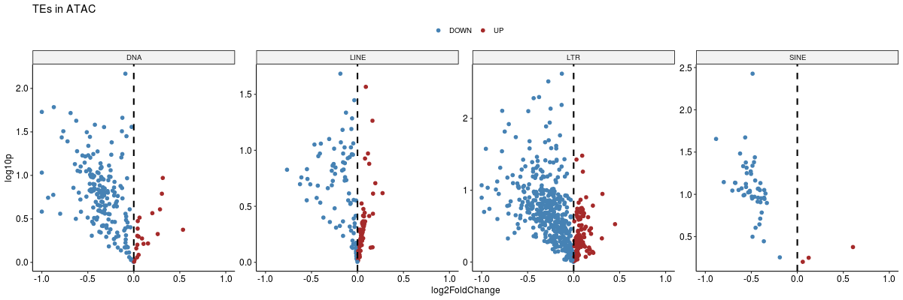
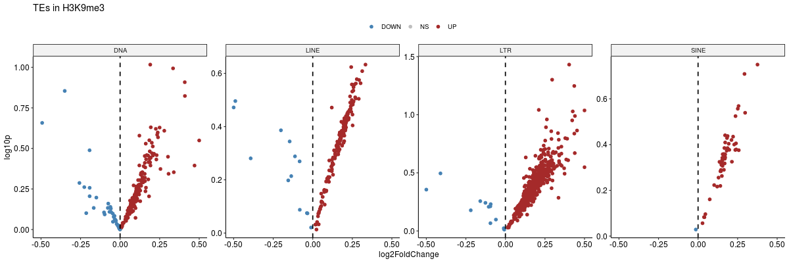
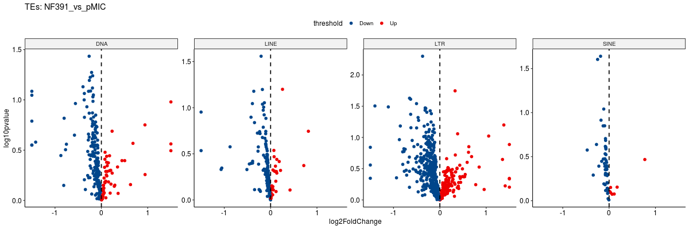

## Fig5F

```r

##Patients
##Patients

All_gsva_seura <- mcreadRDS("./project/WYY_IPM/LWM_Rec_scRNA/Tumor.psuodo.100.rds")
all.gene.counts.100 <- FetchData(object = All_gsva_seura, vars = c("cell_type",rownames(All_gsva_seura)),slot="data")
all.gene.counts.100 <- as.data.frame(all.gene.counts.100)

tmp <- all.gene.counts.100[,c("CGAS","cell_type")]
library(reshape2)
tmp <- melt(tmp)
tmp$cgas_zscore <- scale(tmp$value)

p <- ggboxplot(tmp, x="cell_type", y="cgas_zscore",fill = "cell_type",group = "cell_type",palette = "lancet",outlier.shape=NA)+
    stat_compare_means(comparisons=list(c("NonRec","Rec")),method="t.test")

png(width=300,height=350,"./project/WYY_IPM/scRNA_mmu/for_figure/to_Cell/Patients.cGAS.exp.100.png")
p
dev.off()

tmp <- all.gene.counts.100[,c("TMEM173","cell_type")]
library(reshape2)
tmp <- melt(tmp)
tmp$STING1_zscore <- scale(tmp$value)

p <- ggboxplot(tmp, x="cell_type", y="STING1_zscore",fill = "cell_type",group = "cell_type",palette = "lancet",outlier.shape=NA)+
    stat_compare_means(comparisons=list(c("NonRec","Rec")),method="t.test") 

png(width=300,height=350,"./project/WYY_IPM/scRNA_mmu/for_figure/to_Cell/Patients.STING1.exp.100.png")
p
dev.off()

##A549
##A549

All_gsva_seura <- mcreadRDS("./project/WYY_IPM/scRNA_mmu/raw_files/hs.v2.psuodo.100.rds")
all.gene.counts.100 <- FetchData(object = All_gsva_seura, vars = c("cell_type",rownames(All_gsva_seura)),slot="data")
all.gene.counts.100 <- as.data.frame(all.gene.counts.100)

tmp <- all.gene.counts.100[,c("CGAS","cell_type")]
tmp <- melt(tmp)
tmp$cgas_zscore <- scale(tmp$value)

p <- ggboxplot(tmp, x="cell_type", y="cgas_zscore",fill = "cell_type",group = "cell_type",palette = "lancet",outlier.shape=NA)+
    stat_compare_means(comparisons=list(c("A549_Pmic","A549_391")),method="t.test")

png(width=300,height=400,"./project/WYY_IPM/scRNA_mmu/for_figure/to_Cell/A549.tumor.CGAS.100bin.zscore.png")
p
dev.off()


tmp <- all.gene.counts.100[,c("TMEM173","cell_type")]
tmp <- melt(tmp)
tmp$STING1_zscore <- scale(tmp$value)

p <- ggboxplot(tmp, x = "cell_type", y = "STING1_zscore", fill="cell_type", 
        title="STING_A549",outlier.shape=NA)+
      stat_compare_means(comparisons=list(c("A549_Pmic","A549_391")),method="t.test")+scale_fill_lancet()

png(width=300,height=400,"./project/WYY_IPM/scRNA_mmu/for_figure/to_Cell/A549.tumor.STING.100bin.zscore.png")
p
dev.off()


```
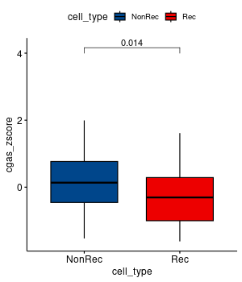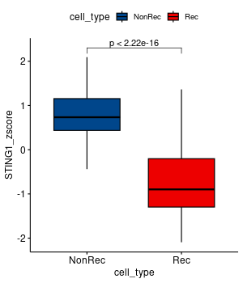
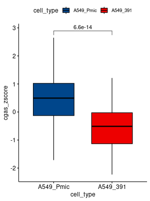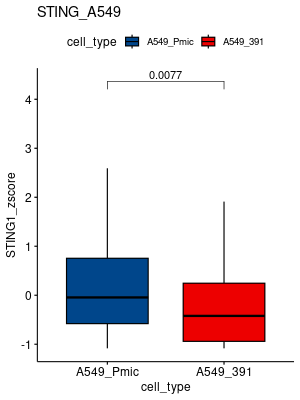


