# Fig.6 & Fig.S6

In this pipeline, we showed the detail codes in Fig.6 & Fig.S6.

```r

library(future.apply)
library(dplyr)
library(limma)
library(Rsubread)
library(trqwe)
library(ggplot2)
library(ChIPQC)
source("./programme/R_PACKAGES/my_code/MyBestFunction_scRNA.R")
library(ChIPseeker)
library(TxDb.Hsapiens.UCSC.hg38.knownGene)
library(clusterProfiler)
library(org.Hs.eg.db)
library(org.Mm.eg.db)
library(dplyr)
library(limma)
library(Rsubread)
library(GenomicRanges)
library(DESeq2)
library(ggrepel)
library(data.table)
library(dplyr)
library(limma)
library(Rsubread)
library(GenomicRanges)


```

## Fig6A

```r


co_ip_counts <- read.csv(row.names=1,"./workshop/RNAseq/lung_metastasis/CO_IP/co_ip_counts_391_v2.csv")
co_ip_counts$baseMean.pct <- co_ip_counts$baseMean / sum(co_ip_counts$baseMean)
co_ip_counts$baseMean.pct <- round(co_ip_counts$baseMean.pct,3) * 100

co_ip_counts_rm0 <- co_ip_counts[which(rowSums(co_ip_counts[,c("Pmic_1_IP","Pmic_2_IP","Pmic_3_IP")]) != 0),]
co_ip_counts_rm0 <- co_ip_counts_rm0[which(co_ip_counts_rm0$Gene.name != "Kmt2c"),]
co_ip_counts_rm0 <- co_ip_counts_rm0[order(co_ip_counts_rm0$T_391.Pmic.Ratio,decreasing=TRUE),]
co_ip_counts_rm0$log10p.p <- -log10(co_ip_counts_rm0$T_391.Pmic.P.value)
pathways_to_label <- c("Dynll1","Ssbp1","Xrcc1","Lig3","Vrk3","Cdkn2a")

p <- ggplot(co_ip_counts_rm0[1:100,], aes(x = T_391.Pmic.Ratio, y = baseMean.pct)) +
  geom_point(aes(size = log10p.p),color = "grey", alpha = 1) +  
  geom_point(aes(size = log10p.p),data = co_ip_counts_rm0[co_ip_counts_rm0$Gene.name %in% pathways_to_label, ], 
             color = "red") +  
  geom_text_repel(data = co_ip_counts_rm0[co_ip_counts_rm0$Gene.name %in% pathways_to_label, ],
                  aes(label = Gene.name),
                  size = 4,
                  box.padding = 0.5,
                  point.padding = 0.2,
                  max.overlaps = 20,
                  segment.color = 'grey50') +
  labs(title = "KMT2C* CO-IP",
       x = "log2FC",
       y = "baseMean.pct") +
  theme_pubr() +scale_size(range=c(1, 6))

png(height=500,width=500,"./workshop/RNAseq/lung_metastasis/CO_IP/COIP_DYNLL1.png")
p
dev.off()

```

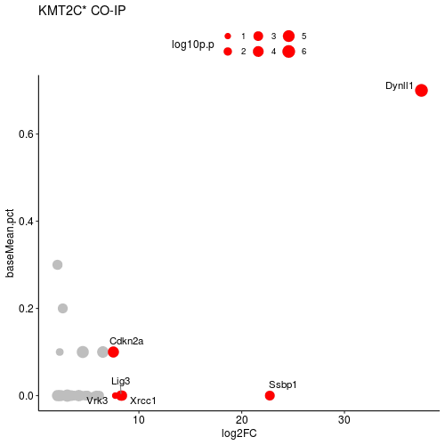

## Fig6C

```r

###get consensus regions
###get consensus regions

consensusToCount_SEACR <- mcreadRDS("./workshop/CUT-TAG/IPM/IPM_A549_DYNLL1/bed/SEACR_DEG/consensusToCount.SEACR.rmIgG.rds")
consensusToCount_SEACR_df <- as.data.frame(consensusToCount_SEACR)

DYNLL1_pMIC <- consensusToCount_SEACR_df[which(rowSums(consensusToCount_SEACR_df[,9:11])>1),]
DYNLL1_pMIC <- GRanges(DYNLL1_pMIC)

DYNLL1_391 <- consensusToCount_SEACR_df[which(rowSums(consensusToCount_SEACR_df[,6:8])>1),]
DYNLL1_391 <- GRanges(DYNLL1_391)

Sig.391 <- fread('./workshop/CUT-TAG/IPM/IPM_A549/MACS3_new/hs_q0.05_narrow/DEG/NF391_vs_IgG_up.bed')
Sig.391 <- as.data.frame(Sig.391)
colnames(Sig.391)[1:3] <- c("chr","start","end")
Sig.391 <- GRanges(Sig.391)

tmp <- list(Sig.391,DYNLL1_pMIC,DYNLL1_391)
names(tmp) <- c("NF391","DYNLL1_pMIC","DYNLL1_391")
masterPeak <- XY_runConsensusRegions(GRangesList(tmp), "none")

masterPeak.anno <- annotatePeak(masterPeak, tssRegion=c(-1, 1),
                         TxDb=TxDb.Hsapiens.UCSC.hg38.knownGene, annoDb="org.Hs.eg.db",verbose=FALSE)

tmp <- as.data.frame(masterPeak.anno)
write.csv(tmp,"./workshop/CUT-TAG/IPM/IPM_A549_DYNLL1/DEG/DYNL11.FLAG.peaks.anno.csv")


###DYNLL_391 vs DYNLL1_pMIC
###DYNLL_391 vs DYNLL1_pMIC

peak_info <- read.csv(row.names=1,"./workshop/CUT-TAG/IPM/IPM_A549_DYNLL1/DEG/DYNL11.FLAG.peaks.anno.csv")
DYNLL1_all_peak <- peak_info[which(peak_info$DYNLL1_pMIC == 1 | peak_info$DYNLL1_391 == 1),]

DYNLL1_pMIC <- peak_info[which(peak_info$DYNLL1_pMIC == 1),"consensusIDs"]
DYNLL1_391 <- peak_info[which(peak_info$DYNLL1_391 == 1),"consensusIDs"]
DYNLL1_pMIC <- as.character(DYNLL1_pMIC)
DYNLL1_391 <- as.character(DYNLL1_391)

NF391_new <- setdiff(DYNLL1_391,DYNLL1_pMIC)
pMIC_only <- setdiff(DYNLL1_pMIC,DYNLL1_391)
cobinding <- intersect(DYNLL1_pMIC,DYNLL1_391)

NF391_new_info <- peak_info[which(peak_info$consensusIDs %in% NF391_new),]
pMIC_only_info <- peak_info[which(peak_info$consensusIDs %in% pMIC_only),]
cobinding_info <- peak_info[which(peak_info$consensusIDs %in% cobinding),]
write.table(NF391_new_info[,1:3],file="./workshop/CUT-TAG/IPM/IPM_A549_DYNLL1/DEG/DYNLL1_391_new_peak.bed",
    sep="\t",col.names=FALSE,row.names=FALSE,quote=FALSE)
write.table(pMIC_only_info[,1:3],file="./workshop/CUT-TAG/IPM/IPM_A549_DYNLL1/DEG/DYNLL1_pMIC_only_peak.bed",
    sep="\t",col.names=FALSE,row.names=FALSE,quote=FALSE)


peak_info <- read.csv(row.names=1,"./workshop/CUT-TAG/IPM/IPM_A549_DYNLL1/DEG/DYNL11.FLAG.peaks.anno.csv")

NF391 <- peak_info[which(peak_info$NF391 == 1),"consensusIDs"]
DYNLL1_pMIC <- peak_info[which(peak_info$DYNLL1_pMIC == 1),"consensusIDs"]
DYNLL1_391 <- peak_info[which(peak_info$DYNLL1_391 == 1),"consensusIDs"]
NF391 <- as.character(NF391)
DYNLL1_pMIC <- as.character(DYNLL1_pMIC)
DYNLL1_391 <- as.character(DYNLL1_391)

DYNLL1_overlap <- intersect(DYNLL1_391,DYNLL1_pMIC)
DYNLL1_overlap_info <- peak_info[which(peak_info$consensusIDs %in% DYNLL1_overlap),]
write.table(DYNLL1_overlap_info[,1:4],file="./workshop/CUT-TAG/IPM/IPM_A549_DYNLL1/DEG/DYNLL1_pMIC_391_ol_peak.bed",sep="\t",col.names=FALSE,row.names=FALSE,quote=FALSE)

colnames(DYNLL1_overlap_info)[1:3] <- c("chr","start","end")
DYNLL1_overlap_GR <- GRanges(DYNLL1_overlap_info)
bamsToCount <- dir("./workshop/CUT-TAG/IPM/IPM_A549_DYNLL1/bam/", full.names = TRUE, pattern = "*.\\.bam$")
bamsToCount <- bamsToCount[c(6:8,3:5)]
regionsToCount <- data.frame(GeneID = paste("ID", seqnames(DYNLL1_overlap_GR), 
    start(DYNLL1_overlap_GR), end(DYNLL1_overlap_GR), sep = "_"), Chr = seqnames(DYNLL1_overlap_GR), 
    Start = start(DYNLL1_overlap_GR), End = end(DYNLL1_overlap_GR), Strand = strand(DYNLL1_overlap_GR))
fcResults <- featureCounts(bamsToCount, annot.ext = regionsToCount, isPairedEnd = TRUE, 
    countMultiMappingReads = FALSE, maxFragLength = 100,nthreads=20)
myCounts <- fcResults$counts
write.csv(myCounts,file="./workshop/CUT-TAG/IPM/IPM_A549_DYNLL1/DEG/subread.pMIC_391_ol_peak.raw.counts.csv")

subread.raw.counts <- read.csv(row.names=1,file="./workshop/CUT-TAG/IPM/IPM_A549_DYNLL1/DEG/subread.pMIC_391_ol_peak.raw.counts.csv")
Group <- c("Dynll1_pMIC","Dynll1_pMIC","Dynll1_pMIC","Dynll1_NF391", "Dynll1_NF391", "Dynll1_NF391")
metaData <- data.frame(Group, row.names = colnames(subread.raw.counts))
metaData$sample <- colnames(subread.raw.counts)
atacDDS <- DESeqDataSetFromMatrix(subread.raw.counts, metaData, ~Group, rowRanges = DYNLL1_overlap_GR)
atacDDS <- DESeq(atacDDS,parallel=T)
norm_counts <- counts(atacDDS,normalized=TRUE)

me3_shA_vs_shR_res <- results(atacDDS, c("Group", "Dynll1_NF391", "Dynll1_pMIC"), format = "GRanges", parallel=T)
me3_shA_vs_shR_res <- as.data.frame(me3_shA_vs_shR_res)
rownames(me3_shA_vs_shR_res) <- rownames(subread.raw.counts)
write.csv(me3_shA_vs_shR_res,"./workshop/CUT-TAG/IPM/IPM_A549_DYNLL1/DEG/subread.pMIC_391_ol_peak.res.csv")

ol_391_vs_pMIC_res <- read.csv(row.names=1,"./workshop/CUT-TAG/IPM/IPM_A549_DYNLL1/DEG/subread.pMIC_391_ol_peak.res.csv")
peak_info$ID <- paste0("ID_",peak_info$seqnames,"_",peak_info$start,"_",peak_info$end)
ol_391_vs_pMIC_res$ID <- rownames(ol_391_vs_pMIC_res)
ol_391_vs_pMIC_res <- merge(ol_391_vs_pMIC_res,peak_info,by="ID")
rownames(ol_391_vs_pMIC_res) <- ol_391_vs_pMIC_res[,1]
ol_391_vs_pMIC_res <- ol_391_vs_pMIC_res[,-1]
colnames(ol_391_vs_pMIC_res)[1:3] <- c("chr","start","end")

ol_391_vs_pMIC_res$group <- ifelse(abs(ol_391_vs_pMIC_res$log2FoldChange) > 0.1, 
  ifelse(ol_391_vs_pMIC_res$log2FoldChange > 0.1, "UP", "DOWN"), "NS")
table(ol_391_vs_pMIC_res$group)

ol_391_vs_pMIC_up <- ol_391_vs_pMIC_res[which(ol_391_vs_pMIC_res$group == "UP"),]
nrow(ol_391_vs_pMIC_up)
ol_391_vs_pMIC_down <- ol_391_vs_pMIC_res[which(ol_391_vs_pMIC_res$group == "DOWN"),]
nrow(ol_391_vs_pMIC_down)
ol_391_vs_pMIC_ns <- ol_391_vs_pMIC_res[which(ol_391_vs_pMIC_res$group == "NS"),]
nrow(ol_391_vs_pMIC_ns)

write.table(ol_391_vs_pMIC_up[,1:3],file="./workshop/CUT-TAG/IPM/IPM_A549_DYNLL1/DEG/DYNLL1_pMIC.391.ol.peak.up.fc0.1.bed",
    sep="\t",col.names=FALSE,row.names=FALSE,quote=FALSE)
write.table(ol_391_vs_pMIC_down[,1:3],file="./workshop/CUT-TAG/IPM/IPM_A549_DYNLL1/DEG/DYNLL1_pMIC.391.ol.peak.down.fc0.1.bed",
    sep="\t",col.names=FALSE,row.names=FALSE,quote=FALSE)
write.table(ol_391_vs_pMIC_ns[,1:3],file="./workshop/CUT-TAG/IPM/IPM_A549_DYNLL1/DEG/DYNLL1_pMIC.391.ol.peak.ns.fc0.1.bed",
    sep="\t",col.names=FALSE,row.names=FALSE,quote=FALSE)


cd ./workshop/CUT-TAG/IPM/IPM_A549_DYNLL1/DEG/
cat DYNLL1_pMIC.391.ol.peak.up.fc0.1.bed DYNLL1_391_new_peak.bed > DYNLL1_pMIC.391.up.merge.fc0.1.bed
cat DYNLL1_pMIC_only_peak.bed DYNLL1_pMIC.391.ol.peak.down.fc0.1.bed > DYNLL1_pMIC.391.down.merge.fc0.1.bed
cat DYNLL1_pMIC.391.up.merge.fc0.1.bed DYNLL1_pMIC.391.down.merge.fc0.1.bed DYNLL1_pMIC.391.ol.peak.ns.fc0.1.bed > DYNLL1_pMIC.391.all.merge.ol.fc0.1.bed

computeMatrix reference-point --referencePoint center -b 3000 -a 3000 \
-R DYNLL1_pMIC.391.up.merge.fc0.1.bed DYNLL1_pMIC.391.ol.peak.ns.fc0.1.bed DYNLL1_pMIC.391.down.merge.fc0.1.bed \
-S ./workshop/CUT-TAG/IPM/IPM_A549_DYNLL1/bw_files/IgG.bw ./workshop/CUT-TAG/IPM/IPM_A549_DYNLL1/bw_files/combine_all_DYNLL1_pMIC.bw ./workshop/CUT-TAG/IPM/IPM_A549_DYNLL1/bw_files/combine_all_DYNLL1_NF391.bw \
--numberOfProcessors 30 --skipZeros \
-o ./workshop/CUT-TAG/IPM/IPM_A549_DYNLL1/bw_files/center.DYNLL1.pMIC.391.DEG.2type.fc0.1.full.mat.gz 

plotHeatmap -m ./workshop/CUT-TAG/IPM/IPM_A549_DYNLL1/bw_files/center.DYNLL1.pMIC.391.DEG.2type.fc0.1.full.mat.gz \
 -out ./workshop/CUT-TAG/IPM/IPM_A549_DYNLL1/bw_files/center.DYNLL1.pMIC.391.DEG.2type.fc0.1.full.png \
 --colorList 'white,green' 'white,green' 'white,green' 'white,green' 'white,green' 'white,green' 'white,green' \
 --missingDataColor "white" \
 --zMax 1.1

computeMatrix reference-point --referencePoint center -b 3000 -a 3000 \
-R DYNLL1_pMIC.391.all.merge.ol.fc0.1.bed \
-S ./workshop/CUT-TAG/IPM/IPM_A549_DYNLL1/bw_files/IgG.bw ./workshop/CUT-TAG/IPM/IPM_A549_DYNLL1/bw_files/combine_all_DYNLL1_pMIC.bw ./workshop/CUT-TAG/IPM/IPM_A549_DYNLL1/bw_files/combine_all_DYNLL1_NF391.bw \
--numberOfProcessors 30 --skipZeros \
-o ./workshop/CUT-TAG/IPM/IPM_A549_DYNLL1/bw_files/center.DYNLL1.pMIC.391.all.2type.fc0.1.full.mat.gz 

plotHeatmap -m ./workshop/CUT-TAG/IPM/IPM_A549_DYNLL1/bw_files/center.DYNLL1.pMIC.391.all.2type.fc0.1.full.mat.gz \
 -out ./workshop/CUT-TAG/IPM/IPM_A549_DYNLL1/bw_files/center.DYNLL1.pMIC.391.all.2type.fc0.1.full.png \
 --colorList 'white,green' 'white,green' 'white,green' 'white,green' 'white,green' 'white,green' 'white,green' \
 --missingDataColor "white" \
 --zMax 1.1 \
 --averageTypeSummaryPlot median


```

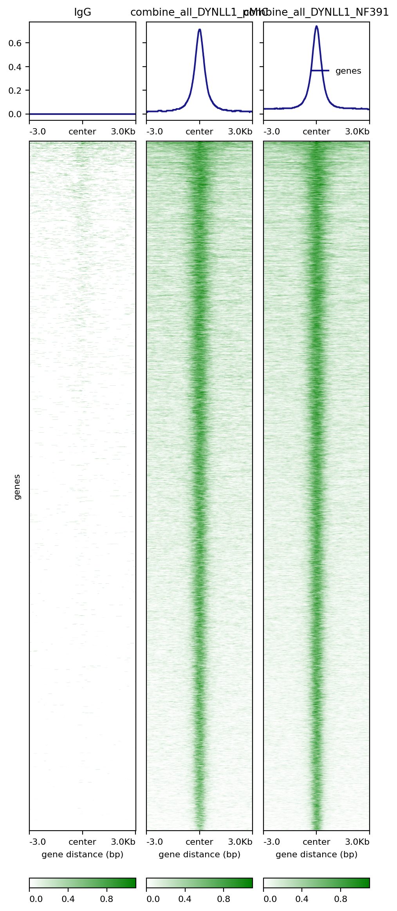 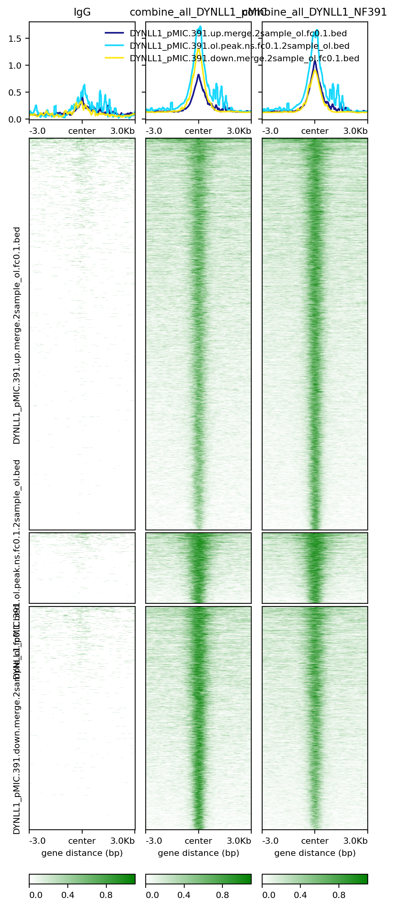

## FigS6B

```r


hs_TEs <- mcreadRDS("./workshop/RNAseq_ref/TEtranscripts/hg38_rmsk_TE.rds",mc.cores=20)
hs_TEs$id <- paste0(hs_TEs[,1],"_",hs_TEs[,2],"_",hs_TEs[,3])
hs_TEs <- hs_TEs[!duplicated(hs_TEs$id),]
hs_TEs <- as(hs_TEs,"GRanges")

library(TxDb.Hsapiens.UCSC.hg38.knownGene)
library(ChIPpeakAnno)

DYNLL1_all_peak <- fread("./workshop/CUT-TAG/IPM/IPM_A549_DYNLL1/DEG/DYNLL1_pMIC.391.all.merge.bed")
DYNLL1_all_peak <- as.data.frame(DYNLL1_all_peak)
colnames(DYNLL1_all_peak) <- c("chr","start","end")
DYNLL1_all_peak <- GRanges(DYNLL1_all_peak)

result <- TE_annotate_peaks_and_plot(
  peak_gr = DYNLL1_all_peak,
  output_file = "./workshop/CUT-TAG/IPM/IPM_A549_DYNLL1/DEG/TE.DYNLL1.pMIC.391.peaks.png"
)

```

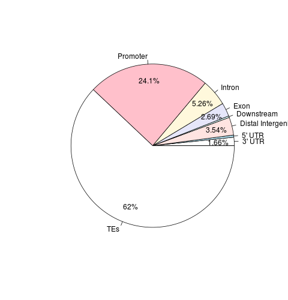 


## Fig6D & 6E

```r

tmp <- read.csv(row.names=1,"./workshop/CUT-TAG/IPM/IPM_A549_DYNLL1/DEG/DYNL11.FLAG.peaks.anno.csv")
NF391 <- tmp[which(tmp$NF391 == 1),"consensusIDs"]
DYNLL1_391 <- tmp[which(tmp$DYNLL1_391 == 1),"consensusIDs"]
NF391 <- as.character(NF391)
DYNLL1_391 <- as.character(DYNLL1_391)

library(Vennerable)
data<-Venn(list(FLAG=NF391,DYNLL1_391=DYNLL1_391))
png("./workshop/CUT-TAG/IPM/IPM_A549_DYNLL1/DEG/venn.peak.DYNLL1.391&FLAG.png")
plot(data,doWeight=T,show = list(Faces = FALSE, DarkMatter = FALSE))
dev.off()

NF391.only <- tmp[which(tmp$NF391 == 1 & tmp$DYNLL1_391 == 0),]
NF391.DYNLL1_391 <- tmp[which(tmp$NF391 == 1 & tmp$DYNLL1_391 == 1),]
DYNLL1_391.only <- tmp[which(tmp$NF391 == 0 & tmp$DYNLL1_391 == 1),]

write.table(NF391.only[,1:3],file="./workshop/CUT-TAG/IPM/IPM_A549_DYNLL1/DEG/NF391.only.bed",
    sep="\t",col.names=FALSE,row.names=FALSE,quote=FALSE)
write.table(NF391.DYNLL1_391[,1:3],file="./workshop/CUT-TAG/IPM/IPM_A549_DYNLL1/DEG/NF391.DYNLL1_391.cobinding.bed",
    sep="\t",col.names=FALSE,row.names=FALSE,quote=FALSE)
write.table(DYNLL1_391.only[,1:3],file="./workshop/CUT-TAG/IPM/IPM_A549_DYNLL1/DEG/DYNLL1_391.only.cobinding.bed",
    sep="\t",col.names=FALSE,row.names=FALSE,quote=FALSE)

cd ./workshop/ATAC_Seq/IPM/IPM_A549/bw_files

computeMatrix reference-point --referencePoint center -b 3000 -a 3000 \
-R ./workshop/CUT-TAG/IPM/IPM_A549_DYNLL1/DEG/NF391.only.bed ./workshop/CUT-TAG/IPM/IPM_A549_DYNLL1/DEG/NF391.DYNLL1_391.cobinding.bed ./workshop/CUT-TAG/IPM/IPM_A549_DYNLL1/DEG/DYNLL1_391.only.cobinding.bed \
-S combine_all_pMIC.bw combine_all_NF391.bw \
--numberOfProcessors 30 --skipZeros \
--missingDataAsZero \
-o ATAC.DYNLL1_391.FLAG.venn.peaks.peaks.mat.gz 

plotHeatmap -m ATAC.DYNLL1_391.FLAG.venn.peaks.peaks.mat.gz \
 -out ATAC.DYNLL1_391.FLAG.venn.peaks.peaks.png \
 --colorList 'white,purple' 'white,purple' 'white,purple' 'white,purple' \
 --missingDataColor "white"


```

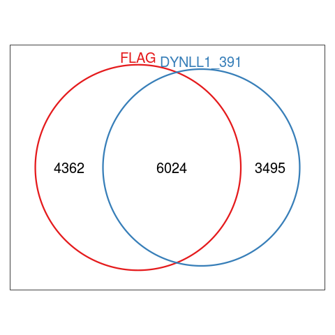  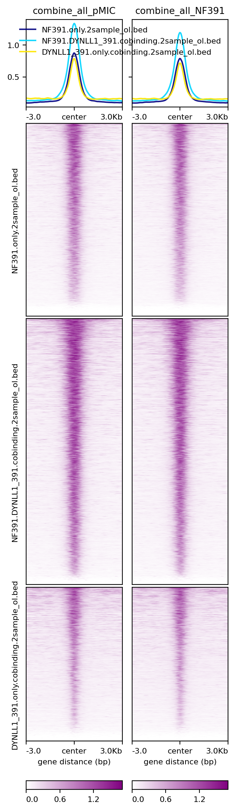 


## FigS6C & Fig6F


```r


peak_info <- read.csv(row.names=1,"./workshop/CUT-TAG/IPM/IPM_A549_DYNLL1/DEG/DYNL11.FLAG.peaks.anno.csv")
FLAG_peaks <- peak_info[which(peak_info$NF391 == 1),]
nrow(FLAG_peaks)
FLAG_peaks_gr <- GRanges(FLAG_peaks[,1:3])

bamsToCount <- dir("./workshop/CUT-TAG/IPM/IPM_A549_DYNLL1/bam/", full.names = TRUE, pattern = "*.\\.bam$")
bamsToCount <- bamsToCount[c(6:8,3:5)]

regionsToCount <- data.frame(GeneID = paste("ID", seqnames(FLAG_peaks_gr), 
    start(FLAG_peaks_gr), end(FLAG_peaks_gr), sep = "_"), Chr = seqnames(FLAG_peaks_gr), 
    Start = start(FLAG_peaks_gr), End = end(FLAG_peaks_gr), Strand = strand(FLAG_peaks_gr))
fcResults <- featureCounts(bamsToCount, annot.ext = regionsToCount, isPairedEnd = TRUE, 
    countMultiMappingReads = FALSE, maxFragLength = 100,nthreads=20)
myCounts <- fcResults$counts
write.csv(myCounts,file="./workshop/CUT-TAG/IPM/IPM_A549_DYNLL1/bed/SEACR_DEG/subread.FLAG.raw.counts.csv")

Group <- c("pMIC", "pMIC", "pMIC","NF391", "NF391", "NF391")
metaData <- data.frame(Group, row.names = colnames(myCounts))
metaData$sample <- gsub(".filter.dupli.bam","",colnames(myCounts))
atacDDS <- DESeqDataSetFromMatrix(myCounts, metaData, ~Group, rowRanges = FLAG_peaks_gr)
atacDDS <- DESeq(atacDDS,parallel=T)

FLAG_dynll1_res <- results(atacDDS, c("Group", "NF391", "pMIC"), format = "GRanges", parallel=T)
FLAG_dynll1_res <- as.data.frame(FLAG_dynll1_res)
write.csv(FLAG_dynll1_res,"./workshop/CUT-TAG/IPM/IPM_A549_DYNLL1/bed/SEACR_DEG/subread.FLAG.res.csv")

FLAG_dynll1_res <- read.csv(row.names=1,"./workshop/CUT-TAG/IPM/IPM_A549_DYNLL1/bed/SEACR_DEG/subread.FLAG.res.csv")
FLAG_dynll1_res$group <- ifelse(abs(FLAG_dynll1_res$log2FoldChange) > 0.1,
    ifelse(FLAG_dynll1_res$log2FoldChange > 0.1,"UP","DOWN"),"NS")
table(FLAG_dynll1_res$group)

FLAG_dynll1_down <- FLAG_dynll1_res[which(FLAG_dynll1_res$group == "DOWN"),]
FLAG_dynll1_up <- FLAG_dynll1_res[which(FLAG_dynll1_res$group == "UP"),]
FLAG_dynll1_ns <- FLAG_dynll1_res[which(FLAG_dynll1_res$group == "NS"),]

write.table(FLAG_dynll1_down, file = "./workshop/CUT-TAG/IPM/IPM_A549_DYNLL1/bed/SEACR_DEG/FLAG_binding.DYNLL1_down.fc0.1.bed",
    sep="\t",col.names=FALSE,row.names=FALSE,quote=FALSE)
write.table(FLAG_dynll1_up, file = "./workshop/CUT-TAG/IPM/IPM_A549_DYNLL1/bed/SEACR_DEG/FLAG_binding.DYNLL1_up.fc0.1.bed",
    sep="\t",col.names=FALSE,row.names=FALSE,quote=FALSE)
write.table(FLAG_dynll1_ns, file = "./workshop/CUT-TAG/IPM/IPM_A549_DYNLL1/bed/SEACR_DEG/FLAG_binding.DYNLL1_ns.fc0.1.bed",
    sep="\t",col.names=FALSE,row.names=FALSE,quote=FALSE)


cd ./workshop/CUT-TAG/IPM/IPM_A549_DYNLL1/bw_files/

computeMatrix reference-point --referencePoint center -b 3000 -a 3000 \
-R ./workshop/CUT-TAG/IPM/IPM_A549_DYNLL1/bed/SEACR_DEG/FLAG_binding.DYNLL1_up.fc0.1.bed ./workshop/CUT-TAG/IPM/IPM_A549_DYNLL1/bed/SEACR_DEG/FLAG_binding.DYNLL1_ns.fc0.1.bed ./workshop/CUT-TAG/IPM/IPM_A549_DYNLL1/bed/SEACR_DEG/FLAG_binding.DYNLL1_down.fc0.1.bed \
-S combine_all_DYNLL1_pMIC.bw combine_all_DYNLL1_NF391.bw \
--numberOfProcessors 30 --skipZeros \
--missingDataAsZero \
-o ./workshop/CUT-TAG/IPM/IPM_A549_DYNLL1/bed/SEACR_DEG/center.FLAG_binding.DYNLL1.DEG.fc0.1.mat.gz 

plotHeatmap -m ./workshop/CUT-TAG/IPM/IPM_A549_DYNLL1/bed/SEACR_DEG/center.FLAG_binding.DYNLL1.DEG.fc0.1.mat.gz \
 -out ./workshop/CUT-TAG/IPM/IPM_A549_DYNLL1/bed/SEACR_DEG/center.FLAG_binding.DYNLL1.DEG.fc0.1.png  \
 --colorList  'white, green' \
 --averageTypeSummaryPlot mean \
 --missingDataColor "white"


#### GO enrichment
#### GO enrichment

FLAG_DYNLL1_up_peak <- fread("./workshop/CUT-TAG/IPM/IPM_A549_DYNLL1/bed/SEACR_DEG/FLAG_binding.DYNLL1_up.fc0.1.bed")
FLAG_DYNLL1_up_peak <- as.data.frame(FLAG_DYNLL1_up_peak)
colnames(FLAG_DYNLL1_up_peak)[1:3] <- c("chr","start","end")
FLAG_DYNLL1_up_peak <- GRanges(FLAG_DYNLL1_up_peak)

FLAG_DYNLL1_up_peak_anno <- annotatePeak(FLAG_DYNLL1_up_peak, tssRegion=c(-1, 1),
                         TxDb=TxDb.Hsapiens.UCSC.hg38.knownGene, annoDb="org.Hs.eg.db",verbose=FALSE)
FLAG_DYNLL1_up_peak_anno <- as.data.frame(FLAG_DYNLL1_up_peak_anno)

GO_ol_peak <- enrichGO(gene = FLAG_DYNLL1_up_peak_anno$geneId, 
             OrgDb = org.Hs.eg.db,
                ont = "all", 
                 pvalueCutoff = 1, 
                     pAdjustMethod = "BH", 
                     qvalueCutoff = 1,
                     minGSSize = 10, 
                     maxGSSize = 500, 
                     readable = T, 
                     pool = FALSE)
write.csv(GO_ol_peak,"./workshop/CUT-TAG/IPM/IPM_A549_DYNLL1/DEG/GO.FLAG_binding.DYNLL1_up.fc0.1.csv")

GO_ol_peak <- read.csv(row.names=1,"./workshop/CUT-TAG/IPM/IPM_A549_DYNLL1/DEG/GO.FLAG_binding.DYNLL1_up.fc0.1.csv")
final_pathway <- GO_ol_peak[which(GO_ol_peak$Description %in% c("regulation of type I interferon-mediated signaling pathway","regulation of interferon-beta production","interferon-beta production","regulation of type I interferon production","type I interferon production","positive regulation of type I interferon production")),]
final_pathway$log2p <- -log2(final_pathway$pvalue)
unique(final_pathway$Description)

p <- ggbarplot(final_pathway,x="Description",y="log2p",orientation = "horiz",color = "red",
  fill="red",sort.val = "asc",title="GO DYNLL1_up & KMT2C*_binding peaks")

png(height=300,width=700,"./workshop/CUT-TAG/IPM/IPM_A549_DYNLL1/DEG/GO.FLAG_binding.DYNLL1_up.fc0.1.png")
p
dev.off()

#### ATAC & RNA
#### ATAC & RNA

cd ./workshop/ATAC_Seq/IPM/IPM_A549/bw_files/

computeMatrix reference-point --referencePoint center -b 3000 -a 3000 \
-R ./workshop/CUT-TAG/IPM/IPM_A549_DYNLL1/bed/SEACR_DEG/FLAG_binding.DYNLL1_up.fc0.1.bed \
-S combine_pMIC_1_2.bw combine_all_NF391_1_2.bw \
--numberOfProcessors 30 --skipZeros \
--missingDataAsZero \
-o ATAC.FLAG_binding.DYNLL1_up.fc0.1.mat.gz 

plotHeatmap -m ATAC.FLAG_binding.DYNLL1_up.fc0.1.mat.gz \
 -out ATAC.FLAG_binding.DYNLL1_up.fc0.1.png \
 --colorList 'white,purple' 'white,purple' 'white,purple' 'white,purple' \
 --missingDataColor "white"


All_gsva_seura <- mcreadRDS("./project/WYY_IPM/scRNA_mmu/raw_files/hs.v2.psuodo.100.rds")
all.gene.counts.100 <- FetchData(object = All_gsva_seura, vars = c("cell_type",rownames(All_gsva_seura)),slot="data")
all.gene.counts.100 <- as.data.frame(all.gene.counts.100)
all.gene.counts.100$cell_type <- factor(all.gene.counts.100$cell_type,levels=c("A549_Pmic","A549_391"))

ol_peak_anno <- read.csv(row.names=1,"./project/WYY_IPM/scRNA_mmu/for_figure/to_Cell/FLAG_binding.DYNLL1_up.fc0.1.anno.csv")

FLAG_gene <- intersect(colnames(all.gene.counts.100),unique(ol_peak_anno$SYMBOL))
all.gene.counts.100$DYNLL1_up_FLAG_binding_genes <- rowMeans(all.gene.counts.100[,FLAG_gene])
all.gene.counts.100$DYNLL1_up_FLAG_binding_genes.zscore <- (all.gene.counts.100$DYNLL1_up_FLAG_binding_genes - mean(all.gene.counts.100$DYNLL1_up_FLAG_binding_genes)) / sd(all.gene.counts.100$DYNLL1_up_FLAG_binding_genes)

p1 <- ggboxplot(all.gene.counts.100,
    x="cell_type",y="DYNLL1_up_FLAG_binding_genes.zscore",fill="cell_type",add="none",outlier.shape=NA)+ stat_compare_means(comparisons =list(c("A549_Pmic","A549_391")),
    label = "p = {p}", method = "t.test") 

png(width=400,height=500,"./project/WYY_IPM/scRNA_mmu/for_figure/to_Cell/A549.RNA.FLAG_binding.DYNLL1_up.fc0.1.png")
p1
dev.off()


```
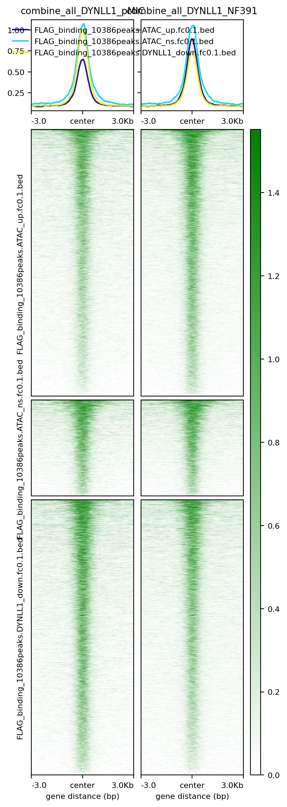  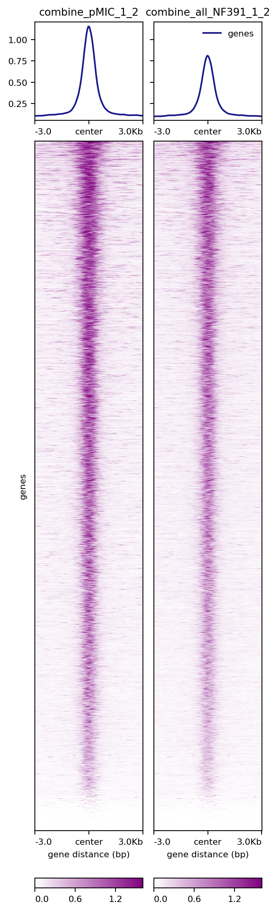  
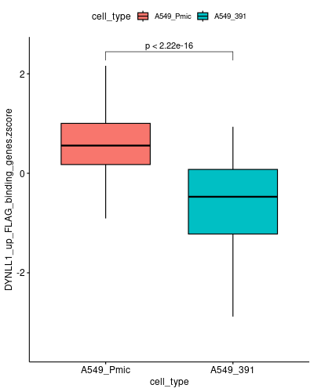    


## Fig6G

```r

hs_TEs_df <- mcreadRDS("./workshop/RNAseq_ref/TEtranscripts/hg38_rmsk_TE.rds",mc.cores=20)
hs_TEs_df$ID <- paste0("ID_",hs_TEs_df$seqnames,"_",hs_TEs_df$start,"_",hs_TEs_df$end)

myCounts <- mcreadRDS(file="./workshop/CUT-TAG/IPM/IPM_A549_DYNLL1/DEG/TE.DYNLL1.counts.rds",mc.cores=20)
myCounts <- as.data.frame(myCounts)
myCounts$ID <- rownames(myCounts)
TE_counts_gene <- inner_join(myCounts,hs_TEs_df,by="ID")
mcsaveRDS(TE_counts_gene,"./workshop/CUT-TAG/IPM/IPM_A549_DYNLL1/DEG/TE.DYNLL1.counts.anno.rds",mc.cores=20)

TE_counts_gene <- TE_counts_gene %>%
  group_by(gene_id) %>%
  mutate(pMIC.1=sum(Dynll1.pMIC.1.filter.dupli.bam),pMIC.2=sum(Dynll1.pMIC.2.filter.dupli.bam),pMIC.3=sum(Dynll1.pMIC.3.filter.dupli.bam),
    p391.1=sum(Dynll1.NF391.1.filter.dupli.bam),p391.2=sum(Dynll1.NF391.2.filter.dupli.bam),p391.3=sum(Dynll1.NF391.3.filter.dupli.bam)) %>%
  distinct(gene_id, .keep_all = TRUE)
TE_counts_gene <- as.data.frame(TE_counts_gene)
TE_counts_gene <- TE_counts_gene[,c(17,19:26)]
TE_counts_gene$ID <- paste0("ID_",TE_counts_gene$class_id,":",TE_counts_gene$family_id,":",TE_counts_gene$gene_id)
rownames(TE_counts_gene) <- TE_counts_gene$ID
write.csv(TE_counts_gene,"./workshop/CUT-TAG/IPM/IPM_A549_DYNLL1/DEG/TE.DYNLL1.gene.counts.csv")

TE_counts_gene <- read.csv(row.names=1,"./workshop/CUT-TAG/IPM/IPM_A549_DYNLL1/DEG/TE.DYNLL1.gene.counts.csv")
TE_counts_gene$FoldChange <- rowMeans(TE_counts_gene[,7:9]) / rowMeans(TE_counts_gene[,4:6])
TE_counts_gene$log2FoldChange <- log2(TE_counts_gene$FoldChange)
TE_counts_gene$baseMean <- rowMeans(TE_counts_gene[,4:9])
TE_counts_gene$ccscore <- TE_counts_gene$log2FoldChange^3 * TE_counts_gene$baseMean
TE_counts_gene$group <- ifelse(abs(TE_counts_gene$log2FoldChange) != 0,
    ifelse(TE_counts_gene$log2FoldChange > 0,"UP","DOWN"),"NS")
table(TE_counts_gene$group)
as.data.frame(table(TE_counts_gene$class_id,TE_counts_gene$group))

p_values <- apply(TE_counts_gene[,c(4:9)], 1, function(x) {
  t.test(x ~ c("pMIC","pMIC","pMIC","p391","p391","p391"))$p.value
})
p_values <- data.frame(Gene = rownames(TE_counts_gene), p_value = p_values)
TE_counts_gene$p <- p_values$p_value
TE_counts_gene$log10p <- -log10(TE_counts_gene$p)

#火山图
show_data <- TE_counts_gene[which(TE_counts_gene$class_id %in% c("DNA","LINE","LTR","SINE")),]
show_data <- show_data[!is.na(show_data$log2FoldChange),]
show_data$log10baseMean <- log10(show_data$baseMean)
show_data[which(show_data$log2FoldChange > 1.5),]$log2FoldChange <- 1.5
show_data[which(show_data$log2FoldChange < -1.5),]$log2FoldChange <- -1.5
show_data$threshold <- as.factor(ifelse(show_data$log2FoldChange> 0 ,'Up','Down'))
as.data.frame(table(show_data$threshold,show_data$class_id))

p2 <- ggplot(show_data, 
   aes(log2FoldChange,log10p,colour=threshold))+ labs(x="log2FoldChange",y="log10p")
p2 <- p2 + geom_point(alpha=1, size=2)  +scale_colour_manual(name = "", values = alpha(c("#4682B4","#A52A2A"), 1))+
   theme_pubr() + facet_wrap(~class_id,scales="free",nrow=1)+ xlim(-1.5,1.5)+
  geom_vline(xintercept=c(0),lty = "dashed",col="black",lwd=1) + ggtitle("TEs: DYNLL1_NF391 vs DYNLL1_pMIC")

ggsave(width=12,height=4,"./workshop/CUT-TAG/IPM/IPM_A549_DYNLL1/DEG/maplot_facet_v2.svg")


```
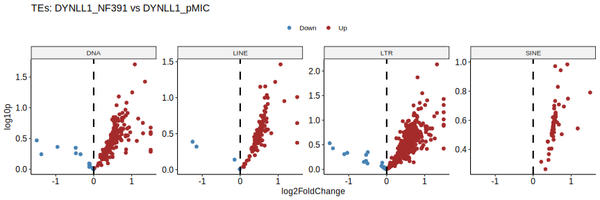


## Fig6I

```r


merge_raw_counts <- read.csv(row.names=1,"./workshop/RNAseq/lung_metastasis/sgDynll1_RNASeq/TEtranscripts_sgDynll1_RNASeq_3group.csv")

sampleTable <- read.csv(row.names=1,"./workshop/RNAseq/lung_metastasis/sgDynll1_RNASeq/sampleTable.csv")
sampleTable_merge <- sampleTable[c(16:18,7:9,1:2),]

dds <- DESeqDataSetFromMatrix(countData = merge_raw_counts,
                                 colData = sampleTable_merge,
                                 design = ~group)
dds <- DESeqDataSet(dds, design = ~group)
dds <- DESeq(dds)
dds_normalize <- counts(dds, normalized=TRUE)
dds_normalize <- as.data.frame(dds_normalize)
rownames(dds_normalize) <- rownames(merge_raw_counts)
write.csv(dds_normalize,"./workshop/RNAseq/lung_metastasis/sgDynll1_RNASeq/outs/TEtranscripts_oldpmic_newsgDynll1_nrom_counts.csv")

dds_normalize <- read.csv(row.names=1,"./workshop/RNAseq/lung_metastasis/sgDynll1_RNASeq/outs/TEtranscripts_oldpmic_newsgDynll1_nrom_counts.csv")

tmp <- dds_normalize
tmpp <- strsplit(rownames(tmp),":")
tmpp <- do.call(rbind,tmpp)
colnames(tmpp) <- c("TE_Gene_id","TE_family_id","TE_class_id")
tmpp <- as.data.frame(tmpp)
tmpp <-  tmpp[which(tmpp$TE_class_id %in% c("LINE","SINE","DNA","LTR")),]
tmpp$TE_name <- paste0(tmpp$TE_Gene_id,":",tmpp$TE_family_id,":",tmpp$TE_class_id)

TE_all <- merge(dds_normalize,tmpp,by.x="row.names",by.y="TE_name")
rownames(TE_all) <- TE_all[,1]
TE_all <- TE_all[,-1]
write.csv(TE_all,"./workshop/RNAseq/lung_metastasis/sgDynll1_RNASeq/outs/TEtranscripts_oldpmic_newsgDynll1_nrom_counts_TE.only.csv")

TE_all <- read.csv(row.names=1,"./workshop/RNAseq/lung_metastasis/sgDynll1_RNASeq/outs/TEtranscripts_oldpmic_newsgDynll1_nrom_counts_TE.only.csv")
table(TE_all$TE_class_id)

DNA <- TE_all[which(TE_all$TE_class_id == "DNA"),]
DNA_counts <- DNA[,c(1:8)]
DNA_counts <- DNA_counts[rowSums(DNA_counts) > 0, ]
DNA_counts_mean <- DNA_counts
DNA_counts_mean$pMIC_sgScr <- rowMeans(DNA_counts_mean[,1:3])
DNA_counts_mean$NF391_sgScr <- rowMeans(DNA_counts_mean[,4:6])
DNA_counts_mean$NF391_sgDynll1 <- rowMeans(DNA_counts_mean[,7:8])
DNA_counts_mean <- DNA_counts_mean[,9:11]

LTR <- TE_all[which(TE_all$TE_class_id == "LTR"),]
LTR_counts <- LTR[,c(1:8)]
LTR_counts <- LTR_counts[rowSums(LTR_counts) > 0, ]
LTR_counts_mean <- LTR_counts
LTR_counts_mean$pMIC_sgScr <- rowMeans(LTR_counts_mean[,1:3])
LTR_counts_mean$NF391_sgScr <- rowMeans(LTR_counts_mean[,4:6])
LTR_counts_mean$NF391_sgDynll1 <- rowMeans(LTR_counts_mean[,7:8])
LTR_counts_mean <- LTR_counts_mean[,9:11]

LINE <- TE_all[which(TE_all$TE_class_id == "LINE"),]
LINE_counts <- LINE[,c(1:8)]
LINE_counts <- LINE_counts[rowSums(LINE_counts) > 0, ]
LINE_counts_mean <- LINE_counts
LINE_counts_mean$pMIC_sgScr <- rowMeans(LINE_counts_mean[,1:3])
LINE_counts_mean$NF391_sgScr <- rowMeans(LINE_counts_mean[,4:6])
LINE_counts_mean$NF391_sgDynll1 <- rowMeans(LINE_counts_mean[,7:8])
LINE_counts_mean <- LINE_counts_mean[,9:11]

SINE <- TE_all[which(TE_all$TE_class_id == "SINE"),]
SINE_counts <- SINE[,c(1:8)]
SINE_counts <- SINE_counts[rowSums(SINE_counts) > 0, ]
SINE_counts_mean <- SINE_counts
SINE_counts_mean$pMIC_sgScr <- rowMeans(SINE_counts_mean[,1:3])
SINE_counts_mean$NF391_sgScr <- rowMeans(SINE_counts_mean[,4:6])
SINE_counts_mean$NF391_sgDynll1 <- rowMeans(SINE_counts_mean[,7:8])
SINE_counts_mean <- SINE_counts_mean[,9:11]

DNA_counts_zscore <- log2(DNA_counts_mean+1)
DNA_counts_zscore <- na.omit(DNA_counts_zscore)
DNA_counts_zscore <- t(apply(DNA_counts_zscore, 1, function(x) (x-mean(x))/sd(x)))
DNA_counts_zscore <- as.data.frame(DNA_counts_zscore)
DNA_counts_zscore$TE <- rownames(DNA_counts_zscore)
library(reshape2)
DNA_counts_zscore_melt <- melt(DNA_counts_zscore)
p1 <- ggboxplot(DNA_counts_zscore_melt,x="variable",y="value",group="variable",fill="variable",palette = "lancet",outlier.shape=NA)+
  stat_compare_means(comparisons=list(c("pMIC_sgScr","NF391_sgScr"),c("NF391_sgScr","NF391_sgDynll1")))+ggtitle("DNA")+rotate_x_text(angle = 45)+NoLegend()
 
LTR_counts_zscore <- log2(LTR_counts_mean+1)
LTR_counts_zscore <- na.omit(LTR_counts_zscore)
LTR_counts_zscore <- t(apply(LTR_counts_zscore, 1, function(x) (x-mean(x))/sd(x)))
LTR_counts_zscore <- as.data.frame(LTR_counts_zscore)
LTR_counts_zscore$TE <- rownames(LTR_counts_zscore)
LTR_counts_zscore_melt <- melt(LTR_counts_zscore)
p2 <- ggboxplot(LTR_counts_zscore_melt,x="variable",y="value",group="variable",fill="variable",palette = "lancet",outlier.shape=NA)+
  stat_compare_means(comparisons=list(c("pMIC_sgScr","NF391_sgScr"),c("NF391_sgScr","NF391_sgDynll1")))+ggtitle("LTR")+rotate_x_text(angle = 45)+NoLegend()
 
LINE_counts_zscore <- log2(LINE_counts_mean+1)
LINE_counts_zscore <- na.omit(LINE_counts_zscore)
LINE_counts_zscore <- t(apply(LINE_counts_zscore, 1, function(x) (x-mean(x))/sd(x)))
LINE_counts_zscore <- as.data.frame(LINE_counts_zscore)
LINE_counts_zscore$TE <- rownames(LINE_counts_zscore)
LINE_counts_zscore_melt <- melt(LINE_counts_zscore)
p3 <- ggboxplot(LINE_counts_zscore_melt,x="variable",y="value",group="variable",fill="variable",palette = "lancet",outlier.shape=NA)+
  stat_compare_means(comparisons=list(c("pMIC_sgScr","NF391_sgScr"),c("NF391_sgScr","NF391_sgDynll1")))+ggtitle("LINE")+rotate_x_text(angle = 45)+NoLegend()
 
SINE_counts_zscore <- log2(SINE_counts_mean+1)
SINE_counts_zscore <- na.omit(SINE_counts_zscore)
SINE_counts_zscore <- t(apply(SINE_counts_zscore, 1, function(x) (x-mean(x))/sd(x)))
SINE_counts_zscore <- as.data.frame(SINE_counts_zscore)
SINE_counts_zscore$TE <- rownames(SINE_counts_zscore)
SINE_counts_zscore_melt <- melt(SINE_counts_zscore)
p4 <- ggboxplot(SINE_counts_zscore_melt,x="variable",y="value",group="variable",fill="variable",palette = "lancet",outlier.shape=NA)+
  stat_compare_means(comparisons=list(c("pMIC_sgScr","NF391_sgScr"),c("NF391_sgScr","NF391_sgDynll1")))+ggtitle("SINE")+rotate_x_text(angle = 45)+NoLegend()

png(width=1000,height=350,"./workshop/RNAseq/lung_metastasis/sgDynll1_RNASeq/outs/TE.TEtranscripts.boxplot.3group.RNA.png")
CombinePlots(list(p1,p2,p3,p4),ncol=4)
dev.off()

```
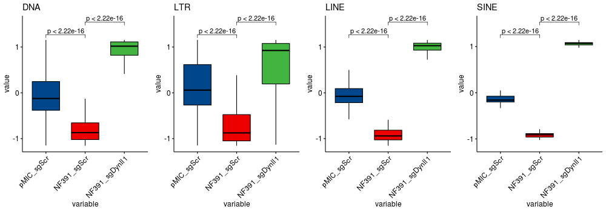
