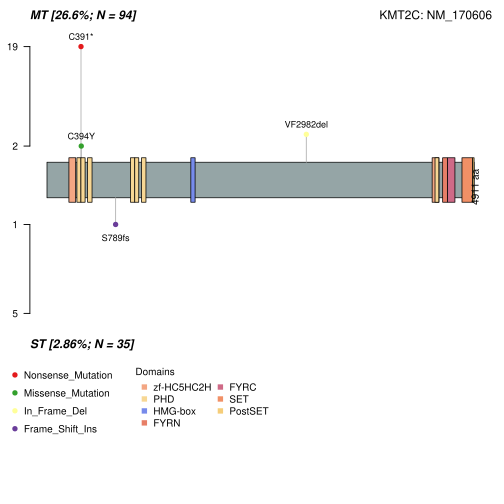
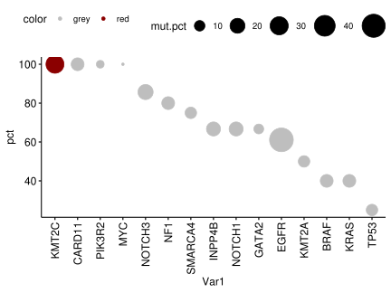
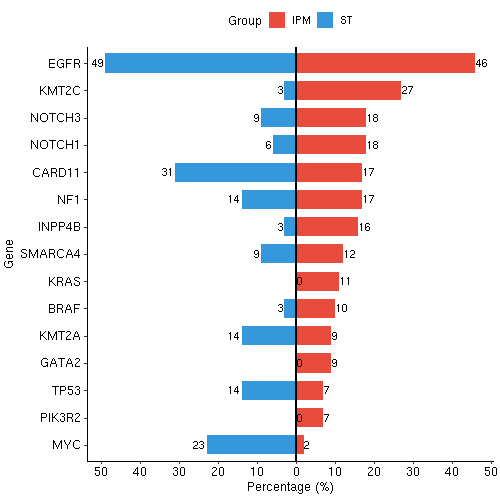

# IPM Fig.1 & Fig.S1

In this pipeline, we showed the detail codes in Fig.1 & Fig.S1.


## Fig1D

```r

library(maftools)
library(data.table)
library(dplyr)
library(RColorBrewer)

IPM_mut_df <- read.csv(row.names=1,"./object/3_Intrapulmonary_metastases/genome/panel/IPM.mut.by_company.v3.csv")
ST_mut_df <- read.csv(row.names=1,"./object/3_Intrapulmonary_metastases/genome/panel/ST.mut.final.by_company.csv")

IPM_clinical_info <- read.csv(row.names=1,"./object/3_Intrapulmonary_metastases/genome/panel/IPM.clinical.info.v2.csv")
ST_clinical_info <- read.csv(row.names=1,"./object/3_Intrapulmonary_metastases/genome/panel/ST.clinical.info.csv")

aa <- unique(IPM_clinical_info$Tumor_Sample_Barcode)  #94

IPM_mut_df <- IPM_mut_df[which(IPM_mut_df$Variant_Classification %in% c('Frame_Shift_Del','Missense_Mutation', 'Nonsense_Mutation', 'Multi_Hit', 'Frame_Shift_Ins',
               'In_Frame_Ins', 'In_Frame_Del')),]
ST_mut_df <- ST_mut_df[which(ST_mut_df$Variant_Classification %in% c('Frame_Shift_Del','Missense_Mutation', 'Nonsense_Mutation', 'Multi_Hit', 'Frame_Shift_Ins',
               'In_Frame_Ins', 'In_Frame_Del')),]

bb <- unique(IPM_mut_df$Tumor_Sample_Barcode)   
setdiff(aa,bb)
nomut_sample <- IPM_mut_df[1:5,]
nomut_sample[,1:(ncol(nomut_sample)-1)] <- NA
nomut_sample[,ncol(nomut_sample)] <- c("P43_MT_2","P56_MT_3","P69_MT_1","P69_MT_2","P69_MT_3")
IPM_mut_df <- rbind(IPM_mut_df,nomut_sample)

IPM_mut_info <- IPM_mut_df[,c("Hugo_Symbol","Tumor_Sample_Barcode","Variant_Classification")]
table(IPM_mut_info$Variant_Classification)
IPM_mut_info <- IPM_mut_info[which(IPM_mut_info$Variant_Classification %in% c('Frame_Shift_Del','Missense_Mutation', 'Nonsense_Mutation', 'Multi_Hit', 'Frame_Shift_Ins',
               'In_Frame_Ins', 'In_Frame_Del')),]
table(IPM_mut_info$Variant_Classification)
IPM_mut_info$patient <- gsub("_IPM*",'',IPM_mut_info$Tumor_Sample_Barcode)
IPM_mut_info$patient <- gsub("_1",'',IPM_mut_info$patient)
IPM_mut_info$patient <- gsub("_2",'',IPM_mut_info$patient)
IPM_mut_info$patient <- gsub("_3",'',IPM_mut_info$patient)
IPM_mut_info$patient <- gsub("_4",'',IPM_mut_info$patient)
IPM_mut_info$patient <- gsub("_5",'',IPM_mut_info$patient)
table(IPM_mut_info$patient)
IPM_mut_patients <- as.data.frame(table(IPM_mut_info$patient,IPM_mut_info$Hugo_Symbol))

IPM_mut_patients_gene_smry <- IPM_mut_patients[which(IPM_mut_patients$Freq!=0),]
IPM_mut_patients_gene_smry <- IPM_mut_patients_gene_smry %>% group_by(Var2) %>% summarize(mut_p=n())
IPM_mut_patients_gene_smry <- as.data.frame(IPM_mut_patients_gene_smry)

IPM_maf <- read.maf(IPM_mut_df,clinicalData = IPM_clinical_info,useAll = TRUE)
IPM_maf.clinical.data <- IPM_maf@clinical.data
IPM_maf.clinical.data <- as.data.frame(IPM_maf.clinical.data)
IPM_maf.clinical.data <- IPM_maf.clinical.data[order(IPM_maf.clinical.data$patient),]

ST_maf <- read.maf(ST_mut_df,clinicalData = ST_clinical_info)
ST_maf.clinical.data <- ST_maf@clinical.data
ST_maf.clinical.data <- as.data.frame(ST_maf.clinical.data)
ST_mut_patients_gene_smry <- as.data.frame(ST_maf@gene.summary)
ST_mut_patients_gene_smry <- ST_mut_patients_gene_smry[,c("Hugo_Symbol","AlteredSamples")]

tmb_ST <- tmb(maf = ST_maf,captureSize=1,logScale=FALSE)
tmb_IPM <- tmb(maf = IPM_maf,captureSize=1,logScale=FALSE)
tmb_ST <- as.data.frame(tmb_ST)
tmb_IPM <- as.data.frame(tmb_IPM)
tmb_ST <- tmb_ST[,1:2]
tmb_IPM <- tmb_IPM[,1:2]

gender=brewer.pal(n = 11, name = 'Pastel2')[c(3,7)]
names(gender) <- c("male","female")

age_class=brewer.pal(n = 8, name = 'Reds')[c(3:5)]
age_class=setNames(age_class,c("<50","50-60",">60"))

pathology=c("grey",brewer.pal(n = 8, name = 'Greens')[2:5])
pathology=setNames(pathology,c("Unknown","AAH","AIS","MIA","ADC"))

clinical_color <- list(gender=gender,age_class=age_class,pathology=pathology)

col = RColorBrewer::brewer.pal(n = 8, name = 'Paired')
names(col) = c('Frame_Shift_Del','Missense_Mutation', 'Nonsense_Mutation', 'Multi_Hit', 'Frame_Shift_Ins',
               'In_Frame_Ins', 'Splice_Site', 'In_Frame_Del')

genes <- c("EGFR","KMT2C","NOTCH3","NOTCH1","CARD11","NF1","INPP4B","SMARCA4","KRAS","BRAF","KMT2A","GATA2","TP53","PIK3R2","MYC")

svg("./object/3_Intrapulmonary_metastases/genome/panel/plots/oncoplot_IPM_v3.svg",width=14)
oncoplot(maf = IPM_maf,
    clinicalFeatures = c("gender",'age_class',"pathology"),
    draw_titv = FALSE,  #TiTv plot
    sampleOrder = IPM_maf.clinical.data$Tumor_Sample_Barcode,
    colors = col,
    annotationColor = clinical_color,
    showTitle = TRUE,
    logColBar = FALSE,
    bgCol="#F5F5F5",
    writeMatrix = FALSE,
    topBarData = tmb_IPM,
    showTumorSampleBarcodes = TRUE,
    removeNonMutated = FALSE,
    barcode_mar = 5,
    gene_mar = 6,
    genes=genes,
    keepGeneOrder = TRUE,
    rightBarData = IPM_mut_patients_gene_smry,
    rightBarLims = c(0, 20),
    sepwd_samples = 1,
    titleText = "MT_IPM" #每个样本间间距
    )
dev.off()

svg("./object/3_Intrapulmonary_metastases/genome/panel/plots/oncoplot_ST_v2.svg")
oncoplot(maf = ST_maf,
    clinicalFeatures = c("gender",'age_class',"pathology"),
    draw_titv = FALSE,  #TiTv plot
    sampleOrder = ST_maf.clinical.data$Tumor_Sample_Barcode,
    colors = col,
    annotationColor = clinical_color,
    showTitle = TRUE,
    logColBar = FALSE,
    bgCol="#F5F5F5",
    writeMatrix = FALSE,
    topBarData = tmb_ST,
    showTumorSampleBarcodes = TRUE,
    removeNonMutated = FALSE,
    barcode_mar = 5,
    gene_mar = 6,
    genes=genes,
    keepGeneOrder = TRUE,
    rightBarData = ST_mut_patients_gene_smry,
    rightBarLims = c(0, 20),
    sepwd_samples = 1,
    titleText = "ST" #每个样本间间距
    )
dev.off()


```
 

## Fig1E

```r

svg("./object/3_Intrapulmonary_metastases/genome/panel/plots/final_2025/colollipopPlot_KMT2C.svg")
lollipopPlot2(m1 = IPM_maf, m2 = ST_maf, gene = "KMT2C", m1_name = "MT", m2_name = "ST",m1_label="all",m2_label="all",showDomainLabel = FALSE)
dev.off()

```


## Fig1F

```r

IPM_mut_df <- read.csv(row.names=1,"./object/3_Intrapulmonary_metastases/genome/panel/IPM.mut.by_company.v3.csv")
IPM_mut_info <- IPM_mut_df[,c("Hugo_Symbol","Tumor_Sample_Barcode","Variant_Classification")]
table(IPM_mut_info$Variant_Classification)
IPM_mut_info <- IPM_mut_info[which(IPM_mut_info$Variant_Classification %in% c('Frame_Shift_Del','Missense_Mutation', 'Nonsense_Mutation', 'Multi_Hit', 'Frame_Shift_Ins',
               'In_Frame_Ins', 'In_Frame_Del')),]
table(IPM_mut_info$Variant_Classification)
IPM_mut_info$patient <- gsub("_IPM*",'',IPM_mut_info$Tumor_Sample_Barcode)
IPM_mut_info$patient <- gsub("_1",'',IPM_mut_info$patient)
IPM_mut_info$patient <- gsub("_2",'',IPM_mut_info$patient)
IPM_mut_info$patient <- gsub("_3",'',IPM_mut_info$patient)
IPM_mut_info$patient <- gsub("_4",'',IPM_mut_info$patient)
IPM_mut_info$patient <- gsub("_5",'',IPM_mut_info$patient)
table(IPM_mut_info$patient)
IPM_mut_patients <- as.data.frame(table(IPM_mut_info$patient,IPM_mut_info$Hugo_Symbol))
IPM_mut_patients_gene_smry <- IPM_mut_patients[which(IPM_mut_patients$Freq!=0),]
IPM_mut_patients_gene_smry <- IPM_mut_patients_gene_smry %>% group_by(Var2) %>% summarize(mut_p=n())
IPM_mut_patients_gene_smry <- as.data.frame(IPM_mut_patients_gene_smry)

MT_mut_df <- read.csv("./object/3_Intrapulmonary_metastases/genome/panel/IPM.mut.by_company.v3.csv")
MPLC_mut_df <- MT_mut_df[grep(c("P45|P47|P50"),MT_mut_df$Tumor_Sample_Barcode),]
IPM_mut_df <- MT_mut_df[setdiff(rownames(MT_mut_df),rownames(MPLC_mut_df)),]

IPM_mut_df <- IPM_mut_df[which(IPM_mut_df$Variant_Classification %in% c('Frame_Shift_Del','Missense_Mutation', 'Nonsense_Mutation', 'Multi_Hit', 'Frame_Shift_Ins',
               'In_Frame_Ins', 'In_Frame_Del')),]
MT_mut_table <- table(IPM_mut_df$Tumor_Sample_Barcode,IPM_mut_df$Hugo_Symbol)
MT_mut_table <- as.data.frame(MT_mut_table)
MT_mut_table$patient <- gsub("([^_]*_[^_]*)_.*", "\\1", MT_mut_table$Var1)
MT_mut_table$patient <- gsub("_MT","", MT_mut_table$patient)
MT_mut_table <- MT_mut_table[which(MT_mut_table$Freq!=0),]

MT_p_list <- lapply(unique(MT_mut_table$patient),function(x) {
    tmp <- MT_mut_table[which(MT_mut_table$patient==x),]
    tmp$Var1 <- as.character(tmp$Var1)
    tmp$Var2 <- as.character(tmp$Var2)
    tmpp <- tmp %>% group_by(Var2) %>% summarize(N_mut=n())
    tmpp <- as.data.frame(tmpp)
    tmpp$N_all <- length(unique(tmp$Var1))
    tmpp$Is.trunk <- ifelse(tmpp$N_mut==tmpp$N_all,"Yes","No")
    tmpp$patient <- x
    return(tmpp)
    })
MT_p_list <- do.call(rbind,MT_p_list)

MT_trunk <- MT_p_list[which(MT_p_list$Is.trunk == "Yes"),]
tmp <- MT_trunk %>% group_by(Var2) %>% summarize(N_mut=n())
tmp <- as.data.frame(tmp)
tmp <- tmp[order(tmp$N_mut,decreasing=TRUE),]
MT_trunk$Var2 <- factor(MT_trunk$Var2,levels=tmp$Var2)

MT_trunk_smr <- as.data.frame(table(MT_trunk$Var2))
colnames(MT_trunk_smr)[2] <- "Trunk.mut.p.num"

IPM_trunk_final <- merge(MT_trunk_smr,IPM_mut_patients_gene_smry,by.x="Var1",by.y="Var2")
IPM_trunk_final$pct <- IPM_trunk_final$Trunk.mut.p.num / IPM_trunk_final$mut_p
IPM_trunk_final$pct <- round(IPM_trunk_final$pct,3) * 100
IPM_trunk_final <- IPM_trunk_final[order(IPM_trunk_final$Trunk.mut.p.num,decreasing=TRUE),]
IPM_trunk_final$Var1 <- as.character(IPM_trunk_final$Var1)
IPM_trunk_final$Var1 <- factor(IPM_trunk_final$Var1,levels=IPM_trunk_final$Var1)

IPM_trunk_final_v2 <- IPM_trunk_final
IPM_trunk_final_v2$group <- "Trunk"
tmp <- IPM_trunk_final_v2[order(IPM_trunk_final_v2$pct,decreasing=TRUE),]
order <- as.character(tmp$Var1)

NonTrunk_data <- IPM_trunk_final_v2
NonTrunk_data$group <- "NonTrunk"
NonTrunk_data$pct <- 100 - NonTrunk_data$pct

IPM_trunk_final_with_NonTrunk <- rbind(IPM_trunk_final_v2, NonTrunk_data)
IPM_trunk_final_with_NonTrunk$Var1 <- as.character(IPM_trunk_final_with_NonTrunk$Var1)
IPM_trunk_final_with_NonTrunk$Var1 <- factor(IPM_trunk_final_with_NonTrunk$Var1,levels=order)

merge_data <- IPM_trunk_final_with_NonTrunk
merge_data$mut.pct <- round(merge_data$mut_p / 34,3) *100
merge_data <- merge_data[which(merge_data$group != "NonTrunk"),]
label_data <- merge_data
genes <- c("EGFR","KMT2C","NOTCH3","NOTCH1","CARD11","NF1","INPP4B","SMARCA4","KRAS","BRAF","KMT2A","GATA2","TP53","PIK3R2","MYC")
label_data <- label_data[label_data$Var1 %in% genes,]
merge_data$Var1 <- as.character(merge_data$Var1)
merge_data$color <- ifelse(merge_data$Var1 == "KMT2C", "red", "grey")
merge_data$mut.pct <- round(merge_data$mut_p / 34,3) *100
merge_data <- merge_data[which(merge_data$group != "NonTrunk"),]

merge_data <- merge_data[order(merge_data$pct,decreasing=TRUE),]
merge_data <- merge_data[which(merge_data$Var1 %in% genes),]
merge_data$Var1 <- factor(merge_data$Var1,levels=merge_data$Var1)

library(ggpubr)
p <- ggdotchart(merge_data, x = "Var1", y ="pct",size="mut.pct",color="color",sorting="none",
       order=merge_data$Var1)+scale_size(range=c(1, 12))+scale_color_manual(values=c("grey","darkred"))

svg(width=6,height=4.5,"./object/3_Intrapulmonary_metastases/genome/panel/plots/Trunkdriver_dotchart_v3.svg")
p
dev.off() 


```



## FigS1E

```r


genes <- c("EGFR","KMT2C","NOTCH3","NOTCH1","CARD11","NF1","INPP4B","SMARCA4","KRAS","BRAF","KMT2A","GATA2","TP53","PIK3R2","MYC")

IPM.genesummary <- read.csv("./object/3_Intrapulmonary_metastases/genome/panel/plots/IPM_mut_patients_gene_smry_nosplicesites.csv",row.names=1)
IPM.genesummary <- as.data.frame(IPM.genesummary)
IPM.genesummary$pct <- round(IPM.genesummary$AlteredSamples / 94 * 100,0)

ST.genesummary <- read.csv("./object/3_Intrapulmonary_metastases/genome/panel/plots/ST_maf_info/ST_mut_patients_gene_smry_nosplicesites.csv",row.names=1)
ST.genesummary <- as.data.frame(ST.genesummary)
ST.genesummary$pct <- round(ST.genesummary$AlteredSamples / 35 * 100,0)

all.data <- merge(ST.genesummary[,c("Hugo_Symbol","pct")],IPM.genesummary[,c("Hugo_Symbol","pct")],by="Hugo_Symbol",all=TRUE)
colnames(all.data) <- c("Hugo_Symbol","pct_ST","pct_IPM")
all.data <- all.data[which(all.data$Hugo_Symbol %in% genes),]
all.data$Hugo_Symbol <- factor(all.data$Hugo_Symbol,levels=genes)
all.data[is.na(all.data)] <- 0

plot_data <- data.frame(
  Hugo_Symbol = rep(all.data$Hugo_Symbol, 2),
  Value = c(-all.data$pct_ST, all.data$pct_IPM),  # ST变负数
  Group = rep(c("ST", "IPM"), each = nrow(all.data))
)
plot_data$Hugo_Symbol <- factor(plot_data$Hugo_Symbol,levels=rev(genes))
plot_data$Group <- factor(plot_data$Group,levels=c("IPM","ST"))

p <- ggplot(plot_data, aes(x = Value, y = Hugo_Symbol, fill = Group)) +
  geom_bar(stat = "identity", width = 0.7) +
  scale_fill_manual(values = c("ST" = "#3498DB", "IPM" = "#E74C3C")) +
  labs(x = "Percentage (%)", y = "Gene", fill = "Group") +
  scale_x_continuous(
    breaks = c(-50, -40, -30, -20, -10, 0, 10, 20, 30, 40, 50),
    labels = c("50", "40", "30", "20", "10", "0", "10", "20", "30", "40", "50")
  ) +
  geom_vline(xintercept = 0, color = "black", size = 0.8) +
  theme_pubr()+
  geom_text(aes(label = abs(Value), 
              hjust = ifelse(Value < 0, 1.1, -0.1)),
          size = 3.5, color = "black")

png(width=500,height=500,"./object/3_Intrapulmonary_metastases/genome/panel/plots/pct.sample.corect.png")
p
dev.off()

```



